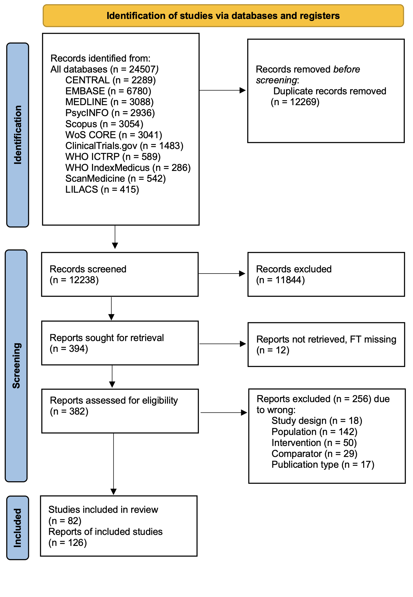

```{r echo = FALSE, include = FALSE, warning = FALSE}
library(knitr)
library(kableExtra)
library(ggplot2)
library(scales)
source("util/nma_analysis.R")
# source("util/nmr_270825.R")

all_studies <- unique(c(pwmac.social_anx$studlab,
                        pwmac.dep$studlab, 
                        pwmac.anx$studlab, 
                        pwmac.bias$studlab, 
                        pwmac.qol$studlab, 
                        pwman.social_anx$studlab, 
                        pwman.dep$studlab, 
                        pwman.anx$studlab, 
                        pwman.bias$studlab,
                        nma_sa$studlab,
                        nma_dep$studlab,
                        nma_anx_subn1$studlab,
                        nma_anx_subn3$studlab,
                        nma_bias$studlab,
                        nma_qol$studlab,
                        nma_acc$studlab,
                        nma_anxn$studlab))
                        

all_clin <- unique(c(pwmac.social_anx$studlab,
                        pwmac.dep$studlab, 
                        pwmac.anx$studlab, 
                        pwmac.bias$studlab, 
                        pwmac.qol$studlab,
                        pwmac.acc$studlab,
                        nma_sa$studlab,
                        nma_dep$studlab,
                        nma_anx_subn1$studlab,
                        nma_anx_subn3$studlab,
                        nma_bias$studlab,
                        nma_qol$studlab,
                        nma_acc$studlab))

all_nonclin <- unique(c(pwman.social_anx$studlab, 
                        pwman.dep$studlab, 
                        pwman.anx$studlab, 
                        pwman.bias$studlab,
                        nma_anxn$studlab))

n_clin_df <- n_long %>%
  dplyr::filter(Short_Title %in% all_clin)
n_clin <- sum(n_clin_df$n_randomised_new, na.rm = TRUE)

n_nonclin_df <- n_long %>%
  dplyr::filter(Short_Title %in% all_nonclin)
n_nonclin <- sum(n_nonclin_df$n_randomised_new, na.rm = TRUE)

n_total <- n_clin + n_nonclin


knitr::opts_chunk$set(echo = T)
options(scipen=100, digits=4)

```

# 1. Methods

In this first iteration of the living systematic review we searched for randomised controlled trials that compared Cognitive Bias Modification (CBM) to either control CBM or other CBM interventions.
We searched for two populations: clinical (i.e. above-threshold symptoms on any standardised measure for social anxiety, or a clinical diagnosis of social anxiety based on any operationalised criteria); and non-clinical (individuals without above-threshold symptoms or a diagnosis of social anxiety but who were subjected to a social stressor).

## 1.1 Database searching and eligibility screening

Eight databases were searched from inception up to October, 2025 (see [protocol](https:///wellcomeopenresearch.org/articles/9-657/v1 "Cognitive bias modification for social anxiety: protocol for a living systematic review of human studies and meta-analysis") for full search strings).
Database search results were imported into [EPPI-Reviewer](https://eppi.ioe.ac.uk/cms/Default.aspx?tabid=2914 "EPPI-Reviewer") and duplicates were removed prior to screening.
All steps related to record screening and data extraction were completed in [EPPI-Reviewer](https://eppi.ioe.ac.uk/cms/Default.aspx?tabid=2914 "EPPI-Reviewer").

Titles and abstracts of the identified records were screened by at least two reviewers (JK, CF, CM, SW, JP).
We retrieved the full-texts and any supporting documents for all records that were not excluded at the title and abstract screening stage.
The full-text screening was conducted by at least two reviewers (JK, CF, CM, SW, JP).
Conflicts at title and abstract, and full-text screening were resolved through discussion between the two reviewers or involvement of a third reviewer.

## 1.2 Extraction of outcome data

The primary outcome was social anxiety symptom severity using social anxiety-specific scales (observer-rated or self-rated) or, in the non-clinical population, social anxiety-related symptoms.\
The secondary outcomes were the following:

-   depression symptom severity, as per observer or self-reported standardised scales;
-   general anxiety symptom severity, as per observer or self-reported standardised scales;
-   change in cognitive bias, as per observer or self-reported standardised scales;
-   quality of life, as per observer or self-reported standardised scales;
-   acceptability, as proportion of participants dropping out for any reason;
-   tolerability, as proportion of participants dropping out due to an adverse event;
-   adverse events reported by the study.

Details of outcome prioritisation and additional information on the full study eligibility criteria can be found in the pre-published [protocol](https:///wellcomeopenresearch.org/articles/9-657/v1 "Cognitive bias modification for social anxiety: protocol for a living systematic review of human studies and meta-analysis").

For social anxiety, depression, general anxiety symptom, change in bias, and quality of life, we extracted outcome data reported at the closest post-intervention time point.
If data collected immediately post-intervention weeks was not available, we considered eligible data after the intervention (with preference to the time point closest to the end of the intervention).
For acceptability, tolerability, safety and adverse events, we extracted outcome data reported at the end of the studies.

When extracting continuous outcomes we extracted mean and standard deviation to two decimal places.
Where standard error was reported, we converted the value to standard deviation.
Baseline and endpoint values were extracted.
These were preferred to change in score and endpoint, in which case the missing value was calculated by adding or subtracting the change in score from the time point given.

When extracting dichotomous outcomes we extracted absolute numbers and, where only percentages of participant groups were reported, the absolute number was calculated and rounded up to the nearest integer.
Adverse events were extracted using the exact wording used to report them in the included studies.

Relevant data was extracted using [EPPI-Reviewer](https://eppi.ioe.ac.uk/cms/Default.aspx?tabid=2914 "EPPI-Reviewer") by at least two reviewers (JK, CF, SW, CM, JP).
EPPI-Reviewer was used to screen records, extract data, and assess risk of bias.

## 1.3 Analysis

We conducted pairwise meta-analysis for all outcomes for CBM versus control.
As the types of CBM and types of controls were heterogeneous, we then conducted a network meta-analysis (NMA) to establish the relative effects of CBM interventions and their respective controls for both the clinical and non-clinical sources of evidence.

Effect sizes were calculated as standardised mean differences (SMDs) for continuous outcomes (social anxiety, depression, and general anxiety symptom severity, change in bias, and quality of life) and odds ratios (ORs) for dichotomous outcomes (acceptability, tolerability, and specific-adverse events).
We calculated the 95% confidence interval (CI) around each pooled effect size.
We used the Hartung-Knapp correction for the 95% CI where more than five studies contributed to the analysis.

For the pairwise meta-analysis, we used a frequentist random effects model for all CBM interventions versus control conditions.
Heterogeneity was assessed by visual inspection of forest plots and presented by the 95% prediction intervals (PI).
Heterogeneity (tau^2^) was estimated using restricted maximum likelihood (REML).
We assumed a common heterogeneity parameter (τ^2^) across treatment comparisons in the NMA random effects model.
For NMA we used a random effects model, separating the different control conditions and the different CBM approaches.
We evaluated inconsistency in the network using both local (separate indirect from direct evidence (SIDE) method) and global (design-by-treatment interaction) tests.
Relative treatment effects are reported in forest plots and league tables, with treatments ordered according to ranking based on the surface under the cumulative ranking curve (SUCRA) (Salanti, Ades, & Ioannidis, 2011).

We performed subgroup analysis comparing a) single versus multi-session interventions b) CBM mode of delivery, and c) studies where an author has an allegiance bias (is involved in the CBM intervention that is tested).
Presence of an allegiance bias was determined by identifying all studies reporting a conflict of interest and examining whether the reported conflict stated that an author was involved in the development of CBM interventions.

## 1.4 Classification of CBM subtypes

The classification of CBM interventions and control conditions was decided at an adjudication meeting of topic experts and methodologists (TF, PC, SB, VC).The lead author classified interventions and control conditions based on the information provided in the study texts and our pre-specified classifications of expected interventions in our protocol (Kennett et al., 2025).
These were distributed to the expert team prior to the meeting.
In the meeting, uncertainties and outstanding interventions were discussed before finalising all classifications.

The team was able to unanimously classify each intervention and control condition after deliberation aside from Heeren et al (2011) and Ferrari et al (2018).
In the case of Heeren et al (2011), the study consisted of four arms: a standard cognitive bias modification for attention (CBM-A) arm, a control CBM-A arm, and two arms which replicated different parts of the CBM-A intervention.This dismantling of the standard CBM-A procedure created two interventions which were neither fully CBM nor fully control.
As such, it was decided at the adjudication meeting to not include these arms in the analysis and analyse only the standard CBM-A and CBM-A control arms.
Similarly, Ferrari et al (2018) used a standard approach-avoidance training (AAT) procedure, a control AAT procedure, and two arms which replicated different parts of the AAT intervention in an attempt to dismantle the intervention and test the effects of its individual mechanisms.
These arms were subsequently excluded from analysis.
Descriptions of the final CBM subtypes can be found in table 1 in section 1.7.

## 1.5 Risk of bias

We assessed the risk of bias for all studies at study level using the RoB2 tool (Sterne et al. 2019). The overall risk of bias was graded as: low risk, if no domains were rated high risk and no more than one domain was rated some concerns; high risk, if any domain was rated high risk; and some concerns, if more than one domain was rated as having some concerns and no domains were rated high risk.
All outcomes for all included studies were assessed by at least two reviewers (JK, CF, CM, SW, JP) and conflicts were resolved by discussion between reviewers.

The risk of bias due to missing evidence in our network was completed in consultation with topic experts using the Risk of Bias due to Missing Evidence in NMA (ROB-MEN) tool (Chioccchia et al., 2021).
The analyses within the ROB-MEN app were conducted choosing a random effects model with a burn-in of 1000, 10000 iterations, a thinning factor of 1, and the assumption of exchangeable treatment-specific interactions.
Control CBM-A was used at the reference treatment, smaller values were specified as desirable, and SMD was used as the effect size.
In the ROB-MEN table, we considered the contribution from biased evidence to be substantially in favour of one intervention if the relative difference between interventions was at least 15%.
The final overall level of risk of bias due to missing evidence in each network estimate was automatically calculated by the ROB-MEN app.

## 1.6 Confidence in the evidence

Confidence in our NMA was assessed using CINeMA (Papakonstantinou et al., 2020).
Within-study bias was assessed by uploading the study-level assessment from the RoB2 tool and using the ‘average risk of bias’ rule implemented in the CINeMA app to assign a level of ‘no concerns’, ‘some concerns’, or ‘major concerns’ to each comparison.
Reporting bias was assessed by uploading the overall ratings from the ROB-MEN tool (described in section 1.6).

Indirectness at the study level was judged qualitatively in conjunction with topic experts.
The ‘average indirectness’ rule implemented in the CINeMA app was used to assign a level of ‘no concerns’, ‘some concerns’, or ‘major concerns’ to each comparison.

For assessing imprecision, heterogeneity, and incoherence a SMD of 0.24 was set as a conservative clinically important size of effect.
This was determined based on the minimum clinically important difference suggested for improvements in general anxiety on standardised scales (Toussaint er al., 2020; Kroenke et al., 2019) and for psychological interventions in other mental health conditions (Cuijpers et al., 2014).
The ratings of 'no concerns’, ‘some concerns’, or ‘major concerns’ for each comparison were automatically generated by the CINeMA app.

To reach an overall level of confidence for each comparison we applied the following rules, in line with other NMAs using CINeMA (Schneider-Thoma et al., 2022; Bighelli et al., 2021).
Possible levels of confidence were ‘high’, ‘moderate’, ‘low’, and ‘very low’.
All overall levels of confidence were by default high for every comparison but were downgraded depending on the individual ratings for each domain.
If any one domain rating for a comparison was ‘major concerns’, the overall level of confidence for that comparison was downgraded by two levels, and where two domain ratings were ‘major concerns’ and an additional rating was either ‘some concerns’ or ‘major concerns’, the comparison was downgraded by three levels.
If a comparison contained any domain rating of 'some concerns', it was downgraded by one level.
Domain ratings were considered jointly and multiple ratings of ‘some concerns’ (and no ratings of ‘major concerns’) for a comparison were not used as justification for downgrading by more than one level, as they may be interconnected.
Similarly, two ratings of ‘major concerns’ and no further ratings of ‘some concerns’ or ‘major concerns’ were not used as justification for downgrading by more than two levels.

Please refer to the [protocol](https:///wellcomeopenresearch.org/articles/9-657/v1 "Cognitive bias modification for social anxiety: protocol for a living systematic review of human studies and meta-analysis") for more details.

A list of included studies, tables, and a list of abbreviations can be found at the end of the document.

## 1.7 Description of CBM subtypes

While all of the CBM interventions in our review targeted a specific cognitive bias by repeatedly exposing individuals to tasks that promote patterns of selective processing, they formed distinct subtypes.

Our CBM-A node was characterised by interventions which seek to train an individual's attention away from negative stimuli.
While they differ in format (e.g. length of the training sessions or mode of delivery) they all use faces and words appearing for around 500ms as stimuli.
Control CBM-A is a 'sham' condition that replicates the procedure of CBM-A but the tasks are neutral (i.e. they do not aim to direct attention).
Opposite CBM-A also replicates the CBM-A process but aims to train individuals' attention towards negative stimuli.

Cognitive bias modification for interpretation (CBM-I) uses similar training procedures to CBM-A but instead repeatedly asks individuals to use words to finish ambiguous sentences to promote positive interpretation of neutral or negative scenarios.
Control CBM-I replicates this procedure but does not aim to change the way that individuals interpret information; opposite CBM-I used the same procedure as CBM-I but aims to train individuals to interpret information more negatively.

Multicomponent CBM combines both CBM-I and CBM-A procedures, usually in a single session and so attempts to target both biases.
It is often accompanied by a 'combined control' procedure where the multicomponent CBM training procedure is replicated but without aiming to modify any bias.

Approach avoidance training (ATT) aims to train individual's action biases away from approaching negative stimuli, using repeated tasks with a joystick to push or pull away from negative words, faces, or images.
Control AAT replicates this procedure but does not aim to systematically retrain any bias.

Each intervention and its respective classification can be found in table 1.

|                                                        |                  |
|----------------------------------------------|--------------------------|
|                                                        |                  |
| **Intervention**                                       | **Node**         |
| AAT (Approach-Avoidance Training)                      | AAT              |
| AAT balanced/positive-negative                         |                  |
| ABM (2D stimuli)                                       | CBM-A            |
| ABM (3D stimuli)                                       |                  |
| ABM contingency                                        |                  |
| ABM disengage/re-engage                                |                  |
| ABM/CBM-A (Attention Bias Modification)                |                  |
| Attention Modification Program (AMP)                   |                  |
| CBM-A                                                  |                  |
| GC-MRT (Gaze-Contingent Music Reward Therapy)          |                  |
| Benign (non-negative) CBM-I                            | CBM-I            |
| Benign CBM-I                                           |                  |
| CBM-I                                                  |                  |
| CBM-I with expectancy induction                        |                  |
| CBM-I + imaginal exposure                              |                  |
| CBM-I with feedback                                    |                  |
| CBM-I + neutral thinking                               |                  |
| CBM-I + relaxation                                     |                  |
| CBM-IS (CBM intepretation of the self)                 |                  |
| Explicit CBM-I                                         |                  |
| IBM/CBM-I (Interpretive Bias Modification)             |                  |
| IMP (Interpretation Modification Program)              |                  |
| Positive CBM-I                                         |                  |
| Relaxation + CBM-I                                     |                  |
| Combined control                                       | Combined control |
| Control AIM                                            |                  |
| Control AAT                                            | Control AAT      |
| Control AAT (Approach-Avoidance Training)              |                  |
| ABM non-contingency                                    | Control CBM-A    |
| Attention Control Condition (ACC)                      |                  |
| Control ABM                                            |                  |
| Control CBM-A                                          |                  |
| GC-MRT (Gaze-Contingent Music Reward Therapy) - shapes |                  |
| Non-valence specific ABM                               |                  |
| Control CBM-I                                          | Control CBM-I    |
| Control CBM-IS (CBM interpretation of the self)        |                  |
| ICC (Interpretation Control Condition)                 |                  |
| AIM (Attention Interpretation Modification)            | Multicomponent   |
| CBM-A + CBM-I                                          |                  |
| Multi-component/Combination CBM                        |                  |
| Opposite ABM/CBM-A                                     | Opposite CBM-A   |
| Opposite CBM-A                                         |                  |
| Opposite IBM/CBM-I                                     | Opposite CBM-I   |
| Opposite CBM-I                                         |                  |
| Treatment as usual (TAU)                               | TAU              |
| Waitlist                                               | Waitlist         |

**Table 1.** Interventions used in the included papers and their respective intervention classifications

# 2. Results

## 2.1 PRISMA Flow diagram



**Figure 1.** PRISMA 2020 flow diagram.

## 2.2 Description of included studies

We identified 82 eligible studies.
The characteristics of the identified studies can be found in **Table 7.** `r length(all_studies)` studies contributed data to at least one outcome (total of `r n_total` participants).
`r length(all_clin)` studies contributed to the clinical source of evidence (total of `r n_clin` participants) and `r length(all_nonclin)` studies contributed to the non-clinical source of evidence (total of `r n_nonclin` participants).

The mean age of participants in the clinical source was `r round((mean_age_clin), 1)` with a mean proportion of `r round((female_prop_clin*100), 1)`% female participants.
The mean age of the participants in the non-clinical source was `r round((mean_age_nonclin), 1)` years.
with a mean proportion of `r round((female_prop_nonclin*100), 1)`% female participants.

## 2.3 Clinical population

### 2.3.1 Social anxiety

#### 2.3.1.1 Pairwise meta-analysis

```{r pwmac_sadforest, echo=FALSE, fig.width=11, fig.height=7}
meta::forest(pwmac.social_anx,
      sortvar = seTE,
      label.e = 'CBM',
      label.c = 'Control',
      label.left = 'Favours CBM',
      label.right = "Favours control",
      smlab = 'Social anxiety severity',
      prediction = TRUE
)
```

**Figure 2.** Forest plot for social anxiety scores (primary outcome) comparing CBM versus control in individuals with social anxiety.
SMD: standardised mean difference, CI: confidence intervals, SD: standard deviation.

The effect of CBM versus control in the clinical source showed an SMD of `r round(pwmac.social_anx$TE.random, 2)` (95% CI: `r round(pwmac.social_anx$lower.random, 2)` to `r round(pwmac.social_anx$upper.random, 2)`).
There is considerable heterogeneity as shown by the 95% prediction interval ranging from `r round(pwmac.social_anx$lower.predict, 2)` to `r round(pwmac.social_anx$upper.predict, 2)`.

#### 2.3.1.2 Network meta-analysis

As there was a high amount of heterogeneity in the interventions and controls used in the included studies, network meta-analysis was conducted to establish the relative effects of CBM subtypes and individual controls.
The network consisted of `r values$k[values$nma == "nma_sa"]` studies, `r values$m[values$nma == "nma_sa"]` comparisons and `r values$n[values$nma == "nma_sa"]` treatments.
In order to construct the network, two studies were removed (Asaani 2014; Bomyea 2023) as they only compared approach avoidance training (AAT) with control AAT and were disconnected from the rest of the network.

```{r nma_sad_netgraph, echo = FALSE, fig.width = 11, fig.height = 5, warning = FALSE}
netgraph(nma_sa, plastic=F, number.of.studies=T, cex.points=nma_sa$k.trts/2)

```

**Figure 3.** Network plot of CBM interventions for social anxiety.
CBM-I = Cognitive Bias Modification for Interpretations; CBM-A = Cognitive Bias Modification for Attention; TAU = Treatment As Usual; Opposite CBM-I = Opposite Cognitive Bias Modification for Interpretations; Opposite CBM-A = Opposite Cognitive Bias Modification for Attention; Multicomponent = Multicomponent CBM; Control CBM-I; Control CBM-I = Control Cognitive Bias Modification for Interpretations; Control CBM-A = Control Cognitive Bias Modification for Attention.

```{r nma_sa_transitivity, echo = FALSE, include = FALSE}
# create pairwise comparisons for plotting
pw_sa_connected1 <- pw_sa_connected %>%
  mutate(
    comparison = paste(pmin(treat1, treat2), pmax(treat1, treat2), sep = " vs ")
  )

# create plotting data for boxplots by comparison


# standardise labels
make_comp <- function(a, b, standardize = TRUE) {
  if (standardize) {
    i <- a <= b
    out <- ifelse(i, paste(a, "vs", b), paste(b, "vs", a))
  } else {
    out <- paste(a, "vs", b)
  }
  out
}

pw_comp <- pw_sa_connected %>%
  mutate(
    # prefer endpoint_n* if present, else n* 
    n1_use = dplyr::coalesce(endpoint_n1, n1),
    n2_use = dplyr::coalesce(endpoint_n2, n2),

    # define comparison label 
    comparison = make_comp(treat1, treat2, standardize = TRUE),

    # pooled (n-weighted) mean age at the comparison level
    mean_age_comp = case_when(
      !is.na(mean_age1) & !is.na(mean_age2) & !is.na(n1_use) & !is.na(n2_use) ~
        (mean_age1 * n1_use + mean_age2 * n2_use) / (n1_use + n2_use),
      !is.na(mean_age1) ~ mean_age1,
      !is.na(mean_age2) ~ mean_age2,
      TRUE ~ NA_real_
    ),

    # female counts and proportion female at the comparison level
    n_female_total = n_female1 + n_female2,
    prop_female    = if_else(!is.na(n1_use + n2_use) & (n1_use + n2_use) > 0,
                             n_female_total / (n1_use + n2_use), NA_real_)
  ) %>%
  select(studlab, comparison, mean_age_comp, n_female_total, prop_female)

```

We evaluated transitivity qualitatively, considering the shared characteristics of participant groups, interventions, and outcomes, as well as consideration of of the distribution of our other pre-specified effect modifiers (allegiance bias, mode of delivery, and single versus multi-session CBM).
Of the `r length(unique(pw_sa_connected1$comparison))` unique comparisons in the network 14 consisted of multi-session interventions, one consisted of single-session interventions, and one consisted of interventions which were multi-session and interventions which were single session.
14 comparisons consisted of interventions which were delivered via computer only and five consisted of interventions delivered via computer and interventions delivered via smartphone or via virtual reality headset or read aloud by the experimenter.
Of the `r length(unique(pw_sa_connected1$comparison))` comparisons in the network one consisted of an intervention that was used in a study where we judged the authors to have a potential allegiance bias.
Bar plots of the distribution of our pre-specified categorical effect modifiers can be found in figures 4 to 6.

```{r nma_sa_sessions_barplot, echo = FALSE, height = 5, width = 8}
ggplot(pw_sa_connected1, aes(x = comparison, fill = session)) +
  geom_bar(position = "fill") +
  labs(
    x = "Pairwise Comparison",
    y = "Proportion of Studies",
    fill = "Number of sessions",
    title = "Distribution of Single or Multi-session CBM"
  ) +
  theme_minimal() +
  coord_flip()

```

**Figure 4.** Barplot of the distribution of the effect modifier number of sessions across pairwise comparisons

```{r nma_sa_mode_barplot, echo = FALSE, height = 5, width = 8}
ggplot(pw_sa_connected1, aes(x = comparison, fill = mode_of_delivery)) +
  geom_bar(position = "fill") +
  labs(
    x = "Pairwise Comparison",
    y = "Proportion of Studies",
    fill = "Mode of Delivery",
    title = "Distribution of CBM Mode of Delivery"
  ) +
  theme_minimal() +
  coord_flip()

```

**Figure 5.** Barplot of the distribution of the effect modifier mode of delivery across pairwise comparisons

```{r nma_sa_alleigance_barplot, echo = FALSE, height = 5, width = 8}
ggplot(pw_sa_connected1, aes(x = comparison, fill = allegiance_bias)) +
  geom_bar(position = "fill") +
  labs(
    x = "Pairwise Comparison",
    y = "Proportion of Studies",
    fill = "Suspected allegiance bias",
    title = "Distribution of suspected allegiance bias"
  ) +
  theme_minimal() +
  coord_flip()

```

**Figure 6.** Barplot of the distribution of the effect modifier mode of delivery across pairwise comparisons.

Due to this relatively homogeneous distribution of effect modifiers and the qualitative similarity between population, intervention, comparator, and outcome among comparisons in the network, we judged transitivity to be plausible.

We found effects across CBM interventions versus Control CBM-A to range from `r round(values$best_te[values$nma == "nma_sa"], 2)` (SMD, 95% CI: `r round(values$best_lower95ci[values$nma == "nma_sa"], 2)` to `r round(values$best_upper95ci[values$nma == "nma_sa"], 2)`, 95% PI: `r round(values$best_lower95pi[values$nma == "nma_sa"], 2)` to `r round(values$best_upper95pi[values$nma == "nma_sa"], 2)`) in `r values$best_tx[values$nma == "nma_sa"]` to `r round(values$worst_te[values$nma == "nma_sa"], 2)` (SMD, 95% CI: `r round(values$worst_lower95ci[values$nma == "nma_sa"], 2)` to `r round(values$worst_upper95ci[values$nma == "nma_sa"], 2)`, 95% PI: `r round(-1*(values$worst_lower95pi[values$nma == "nma_sa"]), 2)` to `r round(values$worst_upper95pi[values$nma == "nma_sa"], 2)`) in `r values$worst_tx[values$nma == "nma_sa"]`. The heterogeneity standard deviation is estimated at `r round(nma_sa$tau, 3)`.

```{r nma_sad_forest, echo = FALSE, warning = FALSE, fig.width = 11, fig.height = 5}
meta::forest(nma_sa,ref = "Control CBM-A", sortvar = -SUCRA)

```

**Figure 7.** Relative treatment effects for social anxiety scores of each intervention versus control CBM-A

All relative treatment effects estimated in the NMA for social anxiety scores are presented in the lower triangle of Table 2 (league table).

```{r nma_sad_league, echo = FALSE, warning = FALSE, message = FALSE}

sad_league <- read_csv("data/ltable_sad_master.csv")
knitr::kable(sad_league, escape = F) %>%
  kable_styling(bootstrap_options = "bordered")
```

**Table 2.** League table for social anxiety scores.
Lower triangle shows the relative treatment effects estimated in the NMA; upper triangle shows the pairwise meta-analysis (direct) estimates.
The effects are presented as SMD, 95% CI, and 95% PI.
Negative values favour the treatment in the column.

#### 2.3.1.3 Inconsistency assessment

There is some evidence of inconsistency in the data.
There were in total `r values$n_loops[values$nma == "nma_sa"]` different treatment comparisons included in loops in the network, and there was inconsistency (according to SIDE p-value\<0.10) in `r values$sig_loops[values$nma == "nma_sa"]`, equal to `r round(get_sig_loops("nma_sa"),2)*100`%.

The p-value from the design-by-treatment test to evaluate global inconsistency is `r round(values$total_q_pval[values$nma == "nma_sa"], 2)`.

#### 2.3.1.4 Subgroup analysis

For the effect modifier mode of delivery, one study used a virtual reality headset, three used a smartphone, two used situations read aloud, and two used any device with internet access and so subgroup analysis was not conducted.
For the effect modifier number of sessions, only two studies used single-session CBM and so subgroup analysis was not conducted.
For the effect modifier allegiance bias, only one study was judged to have suspected allegiance bias and so subgroup analysis was not conducted.

#### 2.3.1.5 Risk of bias

```{r rob_sad_graph, echo = FALSE, warning = FALSE, fig.height=25, fig.width=10}

rob_traffic_light(rob2_sad, tool = "ROB2")

```

**Figure 8.** Risk of bias assessment for each study contributing data on social anxiety using the RoB2 tool

10 studies (29%) were assessed as having 'high' risk of bias due to having 'high' risk of bias in at least one domain.
19 studies (56%) had an overall 'moderate' risk of bias rating as they had 'some concerns' in two domain ratings.
The remaining 5 studies were rated as having a 'low' overall risk of bias.

#### 2.3.1.6 Sensitivity analysis

We conducted a sensitivity analysis for our primary outcome using two pre-specified factors: 1) excluding studies with a high risk of bias and 2) restricting the analysis to studies that recruited participants with a diagnosis of social anxiety disorder (determined by a clinical interview).

Having excluded studies with high risk of bias, the network consisted of `r values$k[values$nma == "nma_rob_sens"]` studies, `r values$m[values$nma == "nma_rob_sens"]` comparisons and `r values$n[values$nma == "nma_rob_sens"]` treatments.

```{r nma_rob_sens_forest, echo = FALSE, warning = FALSE, fig.height = 5, fig.width = 11}

meta::forest(nma_rob_sens, ref = "Control CBM-A", smlab = "Low and moderate RoB only", sortvar=-SUCRA)

```

**Figure 9.** Sensitivity analysis of reduction in social anxiety scores following CBM in a population with social anxiety, excluding studies rated at high risk of bias (reference control CBM-A).

Having restricted the analysis to studies with participants diagnosed with social anxiety disorder, the network consisted of `r values$k[values$nma == "nma_diag_sens"]` studies, `r values$m[values$nma == "nma_diag_sens"]` comparisons and `r values$n[values$nma == "nma_diag_sens"]` treatments.

```{r nma_diag_sens_forest, echo = FALSE, warning = FALSE, fig.height = 5, fig.width = 11}

meta::forest(nma_diag_sens, ref = "Control CBM-A", smlab = "Diagnosis of SAD only", sortvar=-SUCRA)

```

**Figure 10** Sensitivity analysis of reduction in social anxiety scores following CBM in a population with social anxiety, restricting to studies that exclusively recruited individuals with a diagnosis of social anxiety disorder (SAD) (reference control CBM-A).

The sensitivity analyses closely replicated the main results.
There was little difference between CBM-A, control CBM-A, and opposite CBM-A whereas CBM-I was consistently superior to its matched control.

#### 2.3.1.7 Reporting bias

The details of the ROB-MEN assessments are reported below.
See table 8 for the pairwise comparison table and table 9 for the ROB-MEN Table reporting the overall judgement of risk of bias due to missing evidence.

**Within-study bias:**

Using the ROB-MEN app, the rating ‘no bias detected’ was given if no study within that comparison was suspected of under reporting (or selective non reporting) of results and if there were no extra studies in the comparisons (those identified in the review that reported other outcomes but not social anxiety).
Five studies included in the review could not be included in the synthesis for social anxiety.
These contributed to the following comparisons: CBM-A versus control CBM-A; CBM-A versus opposite CBM-A; opposite CBM-A versus control CBM-A; and CBM-I versus control CBM-I.
We found these studies to be potentially biased because they reported non-significant decrease in social anxiety symptom severity compared to the control intervention but did not report values that could be included in the synthesis.
We then assessed the potential impact of these missing results by considering the amount of missing data (in terms of additional sample size) compared to the sample size included in the synthesis for social anxiety for that comparison (columns 2 and 3 in table 8).
We rated these four comparisons as suspected bias towards the active intervention (CBM-A or CBM-I).

**Across-study bias:**

CBM is a new field where many trials are run by universities without industrial funding and few have published protocols; this meant we were not able to restrict our inclusion criteria to prospectively registered studies and it increases the possibility that studies may have been conducted but not published due to non-significant results.
In addition, it is common for novel CBM interventions to be trialled and then discontinued if they do not perform positively.
As such, in consultation with a topic expert, we rated all comparisons with an active CBM intervention (i.e. not control or opposite CBM) to be at suspected risk of across-study bias in favour of the active intervention.
All other comparisons were given the rating ‘no bias detected’ (see table 8 in section 4 ).

**Evaluation of contribution from evidence with suspected bias:**

In the evaluation of contribution of evidence from pairwise comparisons with suspected bias (see columns 2 and 3 in table 9 in section 4), if the relative difference in the contribution of biased evidence between interventions was at least 15%, we considered the comparison to be substantially biased in favour of the intervention with the greatest contribution of biased evidence.
Two comparisons were rated with substantial biased contribution favouring CBM-A: CBM-A versus control CBM-A and CBM-A versus opposite CBM-A.
Two comparisons were judged to have substantial contribution biased towards CBM-I: CBM-I versus control CBM-I; CBM-I versus opposite CBM-I.
A further three comparisons were rated to have a substantial contribution biased towards opposite CBM-A: control CBM-A versus opposite CBM-A; multicomponent versus opposite CBM-A; and opposite CBM-A versus waitlist.

**Evaluation of small-study effects:**

To examine the presence of small-study effects we compared the NMA and NMR estimates and credible intervals (columns 6 and 7 in table 9).
The NMR point estimate for eight comparisons fell outside of the credible interval of the NMA point estimate:

-   CBM-A versus TAU, and CBM-A versus multicomponent CBM were rated as small-study effects favouring CBM-A.

-   Control CBM-A versus multicomponent CBM, CBM-I versus control CBM-A, and control CBM-A versus TAU were rated as small-study effects favouring control CBM-A.

-   CBM-I versus opposite CBM-A, multicomponent CBM versus opposite CBM-A, and opposite CBM-A versus TAU were rated as small-study effects favouring opposite CBM-A.

-   CBM-A versus CBM-I was rated as small-study effects towards opposite CBM-I.

-   Multicomponent CBM versus waitlist was rated as small-study effects favouring waitlist.

There was a good overlap between the credible intervals of each pair of adjusted and unadjusted estimates for the other comparisons so they were rated as no evidence of small-study effects.

**Overall ROB-MEN ratings:**

Overall, nine comparisons were rated as some concerns: CBM-A versus CBM-I; CBM-A versus Control CBM-A; CBM-A versus Multicomponent; CBM-A versus Opposite CBM-A; CBM-I versus Control CBM-I; CBM-I versus Opposite CBM-I; Control CBM-A versus Multicomponent; Control CBM-A versus Opposite CBM-A; Opposite CBM-A versus Waitlist One comparison was rated as high risk: multicomponent versus opposite CBM-A.
The remaining were rated as low risk.
Ratings for each domain within ROB-MEN for each comparison are shown in table 9 in section 4.

#### 2.3.1.8 Confidence in the evidence

Details of the methods used to assess confidence in the evidence can be found in section 1.6.
Table 10 in section 5 contains all domain ratings for the CINeMA tool.

For the within-study bias domain in the CINeMA tool, four comparisons were assessed to have major concerns (TAU versus waitlist, CBM-I versus TAU, control CBM-I versus TAU, opposite CBM-I versus TAU) whereas the remaining comparisons were assessed to have some concerns due to within-study bias.

The ROB-MEN final judgements were used as the reporting bias ratings in CINeMA (see section 2.3.1.7 for ROB-MEN ratings).

For indirectness, we judged whether the study population, interventions, outcomes, and study settings were directly relevant for the research questions.
In terms of population, studies were only eligible if the participants had social anxiety, measured by a standardised scale or diagnostic interview.
We judged this population to be directly relevant to the research question.
All of the interventions in the included studies aimed to change a cognitive bias via repeated task and were confirmed to be relevant by a panel of topic experts.
We judged these as also being directly relevant to the research question.
The outcomes within our review were all validated scales used to measure social anxiety and so are relevant to the research question.
As all of these aspects of our included studies were directly relevant to the research question, we rated all comparisons as low risk for indirectness.

Using a clinically important size of effect of 0.24 (see section 1.6 for details), the CINeMA tool calculated ratings for imprecision, heterogeneity, and incoherence.
22 comparisons were rated to have major concerns due to imprecision, 13 were rated to have some concerns and nine were rated to have no concerns (see column 6 in table 10).

Eight comparisons were judged to have major concerns due to heterogeneity: CBM-A versus multicomponent; CBM-A versus waitlist; CBM-I versus control CBM-I; CBM-A versus opposite CBM-I; CBM-A versus TAU; control CBM-A versus control CBM-I; control CBM-I versus opposite CBM-A; and opposite CBM-A versus control CBM-I.
15 comparisons were rated as some concerns due to heterogeneity, while 22 were rated as no concerns.

For incoherence, 38 comparisons were rated as major concerns, CBM-A versus, control CBM-A was rated as some concerns was and the remaining six were judged to have no concerns due to incoherence.
These were: CBM-A versus opposite CBM-A; CBM-A versus waitlist; CBM-I versus combined control; CBM-I versus waitlist; control CBM-A versus opposite CBM-A; and control CBM-A versus waitlist.

Using the process described in section 1.6, three comparisons (CBM-A versus control CBM-A, CBM-A versus opposite CBM-A, and control CBM-A versus waitlist) were judged to have moderate confidence, 15 were judged to have low confidence, and 27 were judged to have very low confidence.
All CINeMA ratings and reasons for downgrading can be found in table 10 in section 5.

### 2.3.2 Depression

#### 2.3.2.1 Pairwise meta-analysis

```{r pwmac_dep, echo=FALSE, fig.width=11, fig.height=6}
meta::forest(pwmac.dep,
       sortvar = seTE,
       label.e = 'CBM',
       label.c = 'Control',
       label.left = 'Favours CBM',
       label.right = "Favours control",
       smlab = 'Depression symptom severity',
       prediction = TRUE
)
```

**Figure 11.** Forest plot for symptoms of depression (secondary outcome) comparing CBM vs control for individuals with social anxiety post intervention .
SMD: standardised mean difference, 95% CI: 95% confidence intervals, SD: standard deviation.

The effect of CBM versus control in the clinical source showed a SMD of `r round(pwmac.dep$TE.random, 2)` (95% CI: `r round(pwmac.dep$lower.random, 2)` to `r round(pwmac.dep$upper.random, 2)`).
There is some heterogeneity as shown by the 95% prediction interval ranging from `r round(pwmac.dep$lower.predict, 2)` to `r round(pwmac.dep$upper.predict, 2)`.

#### 2.3.2.2 Network meta-analysis

As there was a high amount of heterogeneity in the interventions and controls used in the included studies, network meta-analysis was conducted to establish the relative effects of CBM subtypes and individual controls.
The network consisted of `r values$k[values$nma == "nma_dep"]` studies, `r values$m[values$nma == "nma_dep"]` comparisons and `r values$n[values$nma == "nma_dep"]` treatments.
In order to construct the network, two studies were removed (Asaani 2014; Bomyea 2023) as they only compared approach avoidance training (AAT) with control AAT and were disconnected from the rest of the network.

```{r nma_dep_netgraph, echo = FALSE, fig.width = 11, fig.height = 5, warning = FALSE}
netgraph(nma_dep, plastic=F, number.of.studies=T, cex.points=nma_dep$k.trts/2)
```

**Figure 12.** Network plot of CBM interventions for symptoms of depression.CBM-I = Cognitive Bias Modification for Interpretations; CBM-A = Cognitive Bias Modification for Attention; TAU = Treatment As Usual; Opposite CBM-I = Opposite Cognitive Bias Modification for Interpretations; Opposite CBM-A = Opposite Cognitive Bias Modification for Attention; Multicomponent = Multicomponent CBM; Control CBM-I; Control CBM-I = Control Cognitive Bias Modification for Interpretations; Control CBM-A = Control Cognitive Bias Modification for Attention.

We found effects across CBM interventions versus Control CBM-A to range from `r round(values$best_te[values$nma == "nma_dep"], 2)` (SMD, 95% CI: `r round(values$best_lower95ci[values$nma == "nma_dep"], 2)` to `r round(values$best_upper95ci[values$nma == "nma_dep"], 2)`, 95% PI: `r round(values$best_lower95pi[values$nma == "nma_dep"], 2)` to `r round(values$best_upper95pi[values$nma == "nma_dep"], 2)` ) in `r values$best_tx[values$nma == "nma_dep"]` to `r round(values$worst_te[values$nma == "nma_dep"], 2)` (SMD, 95% CI: `r round(values$worst_lower95ci[values$nma == "nma_dep"], 2)` to `r round(values$worst_upper95ci[values$nma == "nma_dep"], 2)`, 95% PI: `r round(-1*(values$worst_lower95pi[values$nma == "nma_dep"]), 2)` to `r round(values$worst_upper95pi[values$nma == "nma_dep"], 2)`) in `r values$worst_tx[values$nma == "nma_dep"]`.
The heterogeneity standard deviation is estimated at `r round(nma_dep$tau, 3)`.

```{r nma_dep_forest, echo = FALSE, warning = FALSE, fig.width = 11, fig.height = 3}
meta::forest(nma_dep, ref = "Control CBM-A", sortvar = -SUCRA)

```

**Figure 13.** Relative treatment effects for symptoms of depression of each intervention versus Control CBM-A

All relative treatment effects estimated in the NMA for depression scores are presented in the lower triangle of Table 3 (league table).


```{r nma_dep_league, echo = FALSE, warning = FALSE, message = FALSE}

dep_league <- read_csv("data/ltable_dep_master.csv")
knitr::kable(dep_league, escape = F) %>%
  kable_styling(bootstrap_options = "bordered")
```


**Table 3.** League table for depression scores.
Lower triangle shows the relative treatment effects estimated in the NMA; upper triangle shows the pairwise meta-analysis (direct) estimates.
The effects are presented as SMD, 95% CI, and 95% PI.
Negative values favour the treatment in the column.


#### 2.3.2.3 Inconsistency assessment

There were in total `r values$n_loops[values$nma == "nma_dep"]` different treatment comparisons included in loops in the network, and there is inconsistency (according to SIDE p-value\<0.10) in `r values$sig_loops[values$nma == "nma_dep"]`, equal to `r get_sig_loops("nma_dep")*100`%.

The p-value from the design-by-treatment test to evaluate global inconsistency is `r round(values$total_q_pval[values$nma == "nma_dep"], 2)`.

#### 2.3.2.4 Risk of bias

```{r rob_dep_graph, echo = FALSE, warning = FALSE, fig.height = 25, fig.width = 10}

rob_traffic_light(rob2_dep, tool = "ROB2")

```

**Figure 14.** Risk of bias assessment for each study contributing data on depression using the RoB2 tool

3 studies (15%) were assessed as having 'high' risk of bias due to having 'high' risk of bias in at least one domain.
13 studies (65%) had an overall 'moderate' risk of bias rating as they had 'some concerns' in two domain ratings.
The remaining 4 studies were rated as having an overall low risk of bias.

### 2.3.3 General anxiety

#### 2.3.3.1 Pairwise meta-analysis

```{r pwmac_anxforest, echo=FALSE, fig.width=11, fig.height=7}
meta::forest(pwmac.anx,
      sortvar = seTE,
      label.e = 'CBM',
      label.c = 'Control',
      label.left = 'Favours CBM',
      label.right = "Favours control",
      smlab = 'General anxiety severity',
      prediction = TRUE
)
```

**Figure 15.** Forest plot for general anxiety scores (secondary outcome) comparing CBM versus control post intervention in individuals with social anxiety.
SMD: standardised mean difference, 95% CI: 95% confidence intervals, SD: standard deviation.

The effect of CBM versus control in the clinical source showed a SMD of `r round(pwmac.anx$TE.random, 2)` (95% CI: `r round(pwmac.anx$lower.random, 2)` to `r round(pwmac.anx$upper.random, 2)`).
There is some heterogeneity as shown by the 95% prediction interval ranging from `r round(pwmac.anx$lower.predict, 2)` to `r round(pwmac.anx$upper.predict, 2)`.

#### 2.3.3.2 Network meta-analysis

As there was a high amount of heterogeneity in the interventions and controls used in the included studies, network meta-analysis was conducted to establish the relative effects of CBM subtypes and individual controls.
This showed three disconnected networks.
Subnetwork 3 was not analysed as it only contained 1 study and the remaining subnetworks were analysed separately.

Subnetwork 1 consisted of `r values$k[values$nma == "nma_anx_subn1"]` studies, `r values$m[values$nma == "nma_anx_subn1"]` comparisons and `r values$n[values$nma == "nma_anx_subn1"]` treatments.
Subnetwork 2 consisted of `r values$k[values$nma == "nma_anx_subn3"]` studies, `r values$m[values$nma == "nma_anx_subn3"]` comparisons and `r values$n[values$nma == "nma_anx_subn3"]` treatments.

```{r nma_anx_subn1_netgraph, echo = FALSE, fig.width = 11, fig.height = 5, warning = FALSE}
netgraph(nma_anx_subn1, plastic=F, number.of.studies=T, cex.points=nma_anx_subn1$k.trts/2)

```

**Figure 16.** Network (subnetwork 1) plot of CBM interventions contributing data on general anxiety in individuals with social anxiety.
CBM-A = Cognitive Bias Modification for Attention; Opposite CBM-A = Opposite Cognitive Bias Modification for Attention; Multicomponent = Multicomponent CBM; Control CBM-A = Control Cognitive Bias Modification for Attention.

```{r nma_anx_subn3_netgraph, echo = FALSE, fig.width = 11, fig.height = 5}
netgraph(nma_anx_subn3, plastic=F, number.of.studies=T, cex.points=nma_anx_subn3$k.trts/2)
```

**Figure 17.** Subnetwork plot of CBM interventions contributing data on general anxiety in individuals with social anxiety.
CBM-I = Cognitive Bias Modification for Interpretations; Control CBM-I = Control Cognitive Bias Modification for Interpretations

In subnetwork 1 we found effects across CBM interventions versus control CBM-A list to range from `r round(values$best_te[values$nma == "nma_anx_subn1"], 2)` (SMD, 95% CI: `r round(values$best_lower95ci[values$nma == "nma_anx_subn1"], 2)` to `r round(values$best_upper95ci[values$nma == "nma_anx_subn1"], 2)`) in `r values$best_tx[values$nma == "nma_anx_subn1"]` to `r round(values$worst_te[values$nma == "nma_anx_subn1"], 2)` (SMD, 95% CI: `r round(values$worst_lower95ci[values$nma == "nma_anx_subn1"], 2)` to `r round(values$worst_upper95ci[values$nma == "nma_anx_subn1"], 2)`) in `r values$worst_tx[values$nma == "nma_anx_subn1"]`.
The heterogeneity standard deviation is estimated at `r round((nma_anx_subn1$tau), 2)`.

```{r nma_anx_subn1forest, echo = FALSE, warning = FALSE, fig.width = 11, fig.height = 3}
meta::forest(nma_anx_subn1, ref = "Control CBM-A", sortvar = -SUCRA)

```

**Figure 18.** Relative treatment effects for general anxiety scores of each intervention versus control CBM-A in subnetwork 1.

In subnetwork 2 we found effects across CBM interventions versus control CBM-I to range from `r round(values$best_te[values$nma == "nma_anx_subn3"], 2)` (SMD, 95% CI: `r round(values$best_lower95ci[values$nma == "nma_anx_subn3"], 2)` to `r round(values$best_upper95ci[values$nma == "nma_anx_subn3"], 2)`) in `r values$best_tx[values$nma == "nma_anx_subn3"]` to `r round(values$worst_te[values$nma == "nma_anx_subn3"], 2)` (SMD, 95% CI: `r round(values$worst_lower95ci[values$nma == "nma_anx_subn3"], 2)` to `r round(values$worst_upper95ci[values$nma == "nma_anx_subn3"], 2)`) in `r values$worst_tx[values$nma == "nma_anx_subn3"]`.
The heterogeneity standard deviation is estimated at `r round((nma_anx_subn3$tau), 2)`.

```{r nma_anx_subn3forest, echo = FALSE, warning = FALSE, fig.width = 11, fig.height = 3}
meta::forest(nma_anx_subn3, ref = "Control CBM-I", sortvar = -SUCRA)

```

**Figure 19.** Relative treatment effects for social anxiety scores of each intervention versus control CBM-I in subnetwork 2.

#### 2.3.3.3 Inconsistency assessment

In subnetwork 1.
there were in total `r values$n_loops[values$nma == "nma_anx_subn1"]` different treatment comparisons included in a closed loop in the network, and there is inconsistency (according to SIDE p-value\<0.10) in `r values$sig_loops[values$nma == "nma_anx_subn1"]`, equal to `r get_sig_loops("nma_anx_subn1")*100`%.

The p-value from the design-by-treatment test to evaluate global inconsistency for subnetwork 1 is `r round(values$total_q_pval[values$nma == "nma_anx_subn1"], 2)`.

Inconsistency could not be evaluated in subnetwork 2 as there were no closed loops.

#### 2.3.3.4 Risk of bias

```{r rob_anx_graph, echo = FALSE, warning = FALSE, fig.height = 25, fig.width = 8}

rob_traffic_light(rob2_anx, tool = "ROB2")

```

**Figure 20.** Risk of bias assessment for each study contributing data on general anxiety using the RoB2 tool

5 studies (18%) were assessed as having 'high' risk of bias due to having 'high' risk of bias in at least one domain.
8 studies (44%) had an overall 'moderate' risk of bias rating as they had 'some concerns' in two domain ratings.
The remaining 5 studies were rated as having an overall low risk of bias.

### 2.3.4 Change in bias

#### 2.3.4.1 Pairwise meta-analysis

```{r pwmac_bias_forest, echo=FALSE, fig.width=11, fig.height=6}
meta::forest(pwmac.bias,
       sortvar = seTE,
       label.e = 'CBM',
       label.c = 'Control',
       label.left = 'Favours control',
       label.right = "Favours CBM",
       smlab = 'Change in bias',
       prediction = TRUE
)
```

**Figure 21**.
Forest plot for change in bias comparing CBM vs control for individuals with social anxiety post intervention .
SMD: standardised mean difference, 95% CI: 95% confidence intervals, SD: standard deviation.

The effect of CBM versus control in the clinical source showed a SMD of `r round(pwmac.bias$TE.random, 2)` (95% CI: `r round(pwmac.bias$lower.random, 2)` to `r round(pwmac.bias$upper.random, 2)`).
There is some heterogeneity as shown by the 95% prediction interval ranging from `r round(pwmac.bias$lower.predict, 2)` to `r round(pwmac.bias$upper.predict, 2)`.

#### 2.3.4.2 Network meta-analysis

As there was a high amount of heterogeneity in the interventions and controls used in the included studies, network meta-analysis was conducted to establish the relative effects of CBM subtypes and individual controls.
The network consisted of `r values$k[values$nma == "nma_bias"]` studies, `r values$m[values$nma == "nma_bias"]` comparisons and `r values$n[values$nma == "nma_bias"]` treatments.
In order to construct the network, two studies were removed (Asaani 2014; Bomyea 2023) as they only compared approach avoidance training (AAT) with control AAT and so formed a separate network.

```{r nma_biasnetgraph, echo = FALSE, fig.width = 11, fig.height = 5}
netgraph(nma_bias, plastic=F, number.of.studies=T, cex.points=nma_bias$k.trts/2)

```

**Figure 22.** Network plot of CBM interventions contributing data on change in bias in individuals with social anxiety.
CBM-I = Cognitive Bias Modification for Interpretations; CBM-A = Cognitive Bias Modification for Attention; TAU = Treatment As Usual; Opposite CBM-A = Opposite Cognitive Bias Modification for Attention; Multicomponent = Multicomponent CBM; Control CBM-I; Control CBM-I = Control Cognitive Bias Modification for Interpretations; Control CBM-A = Control Cognitive Bias Modification for Attention.

We found effects across CBM interventions versus control CBM-A to range from `r round(values$best_te[values$nma == "nma_bias"], 2)` (SMD, 95% CI: `r round(values$best_lower95ci[values$nma == "nma_bias"], 2)` to `r round(values$best_upper95ci[values$nma == "nma_bias"], 2)`, 95% PI: `r round(values$best_lower95pi[values$nma == "nma_bias"], 2)` to `r round(values$best_upper95pi[values$nma == "nma_bias"], 2)` ) in `r values$best_tx[values$nma == "nma_bias"]` to `r round(values$worst_te[values$nma == "nma_bias"], 2)` (SMD, 95% CI: `r round(values$worst_lower95ci[values$nma == "nma_bias"], 2)` to `r round(values$worst_upper95ci[values$nma == "nma_bias"], 2)`, 95% PI: `r round(values$worst_lower95pi[values$nma == "nma_bias"], 2)` to `r round(values$worst_upper95pi[values$nma == "nma_bias"], 2)`) in `r values$worst_tx[values$nma == "nma_bias"]`.
The heterogeneity standard deviation is estimated at `r round(nma_bias$tau, 2)`.

```{r nma_biasforest, echo = FALSE, fig.width = 11, fig.height = 5, warning = FALSE}
meta::forest(nma_bias, ref = "Control CBM-A", sortvar = -SUCRA)

```

**Figure 23.** Relative treatment effects for change in bias scores of each intervention versus control CBM-A.
CBM-I = Cognitive Bias Modification for Interpretations; CBM-A = Cognitive Bias Modification for Attention; TAU = Treatment As Usual; Opposite CBM-A = Opposite Cognitive Bias Modification for Attention; Multicomponent = Multicomponent CBM; Control CBM-I; Control CBM-I = Control Cognitive Bias Modification for Interpretations; Control CBM-A = Control Cognitive Bias Modification for Attention.

All relative treatment effects estimated in the NMA for change in bias scores are presented in the lower triangle of Table 4 (league table).

```{r nma_bias_league, echo = FALSE, warning = FALSE, message = FALSE}

bias_league <- read_csv("data/ltable_bias_master.csv")
knitr::kable(bias_league, escape = F) %>%
  kable_styling(bootstrap_options = "bordered")
```

**Table 4.** League table for change in bias scores.
Lower triangle shows the relative treatment effects estimated in the NMA; upper triangle shows the pairwise meta-analysis (direct) estimates.
The effects are presented as SMD, 95% CI, and 95% PI.
Negative values favour the treatment in the column.

#### 2.3.4.3 Inconsistency assessment

There were in total `r values$n_loops[values$nma == "nma_bias"]` different treatment comparisons included in loops in the network, and there is inconsistency (according to SIDE p-value\<0.10) in `r values$sig_loops[values$nma == "nma_bias"]`, equal to `r get_sig_loops("nma_bias")`%.

The p-value from the design-by-treatment test to evaluate global inconsistency is `r round(values$total_q_pval[values$nma == "nma_bias"], 2)`.

#### 2.3.4.4 Risk of bias

```{r rob_bias_graph, echo = FALSE, warning = FALSE, fig.height = 25, fig.width = 8}

rob_traffic_light(rob2_bias, tool = "ROB2")

```

**Figure 24.** Risk of bias assessment for each study contributing data on change in bias using the RoB2 tool

7 studies (29%) were assessed as having 'high' risk of bias due to having 'high' risk of bias in at least one domain 15 studies (63%) had an overall 'moderate' risk of bias rating as they had 'some concerns' in two domain ratings.
The remaining 2 studies were rated as having a 'low' overall risk of bias.

### 2.3.5 Quality of life

#### 2.3.5.1 Pairwise meta-analysis

```{r pwmac_qolforest, echo=FALSE, fig.width=11, fig.height=3}
meta::forest(pwmac.qol,
      sortvar = seTE,
      common = T,
      label.e = 'CBM',
      label.c = 'Control',
      label.left = 'Favours CBM',
      label.right = "Favours control",
      smlab = 'Quality of life',
      prediction = FALSE
)
```

**Figure 25.** Forest plot for quality of life scores comparing CBM versus control post intervention in individuals with social anxiety.
SMD: standardised mean difference, 95% CI: 95% confidence intervals, SD: standard deviation.

The effect of CBM versus control in the clinical source showed a SMD of `r round(pwmac.qol$TE.random, 2)` (95% CI: `r round(pwmac.qol$lower.random, 2)` to `r round(pwmac.qol$upper.random, 2)`).

#### 2.3.5.2 Network meta-analysis

As there was a high amount of heterogeneity in the interventions and controls used in the included studies, network meta-analysis was conducted to establish the relative effects of CBM subtypes and individual controls.
The network consisted of `r values$k[values$nma == "nma_qol"]` studies, `r values$m[values$nma == "nma_qol"]` comparisons and `r values$n[values$nma == "nma_qol"]` treatments.
In order to construct the network, two studies were removed (Asaani 2014; Bomyea 2023) as they only compared approach avoidance training (AAT) with control AAT and so formed a separate network.

```{r nma_qol_netgraph, echo = FALSE, fig.width = 11, fig.height = 5, warning = FALSE}
netgraph(nma_qol, plastic=F, number.of.studies=T, cex.points=nma_qol$k.trts/2)
```

**Figure 26.** Network plot of CBM interventions for quality of life.
CBM-I = Cognitive Bias Modification for Interpretations; CBM-A = Cognitive Bias Modification for Attention; TAU = Treatment As Usual; Opposite CBM-I = Opposite Cognitive Bias Modification for Interpretations; Opposite CBM-A = Opposite Cognitive Bias Modification for Attention; Multicomponent = Multicomponent CBM; Control CBM-I; Control CBM-I = Control Cognitive Bias Modification for Interpretations; Control CBM-A = Control Cognitive Bias Modification for Attention.

We found effects across CBM interventions versus control CBM-A to range from `r round(values$best_te[values$nma == "nma_qol"], 2)` (SMD, 95% CI: `r round(values$best_lower95ci[values$nma == "nma_qol"], 2)` to `r round(values$best_upper95ci[values$nma == "nma_qol"], 2)`, 95% PI: `r round(values$best_lower95pi[values$nma == "nma_qol"], 2)` to `r round(values$best_upper95pi[values$nma == "nma_qol"], 2)` ) in `r values$best_tx[values$nma == "nma_qol"]` to `r round(values$worst_te[values$nma == "nma_qol"], 2)` (SMD, 95% CI: `r round(values$worst_lower95ci[values$nma == "nma_qol"], 2)` to `r round(values$worst_upper95ci[values$nma == "nma_qol"], 2)`, 95% PI: `r round(values$worst_lower95pi[values$nma == "nma_qol"], 2)` to `r round(values$worst_upper95pi[values$nma == "nma_qol"], 2)`) in `r values$worst_tx[values$nma == "nma_qol"]`.
The heterogeneity standard deviation is estimated at `r round((nma_qol$tau), 2)`.

```{r nma_qolforest, echo = FALSE, warning = FALSE, fig.width = 11, fig.height = 3}
meta::forest(nma_qol,ref = "Control CBM-A", sortvar = -SUCRA)

```

**Figure 27.** Relative treatment effects for quality of life scores of each intervention versus control CBM-I.
CBM-I = Cognitive Bias Modification for Interpretations; CBM-A = Cognitive Bias Modification for Attention; Opposite CBM-A = Opposite Cognitive Bias Modification for Attention; Multicomponent = Multicomponent CBM; Control CBM-I; Control CBM-A = Control Cognitive Bias Modification for Attention.

All relative treatment effects estimated in the NMA for quality of life and functioning scores are presented in the lower triangle of Table 5 (league table).

```{r nma_qol_league, echo = FALSE, warning = FALSE, message = FALSE}

qol_league <- read_csv("data/ltable_qol_master.csv")
knitr::kable(qol_league, escape = F) %>%
  kable_styling(bootstrap_options = "bordered")
```

**Table 5.** League table for quality of life and functioning scores.
Lower triangle shows the relative treatment effects estimated in the NMA; upper triangle shows the pairwise meta-analysis (direct) estimates.
The effects are presented as SMD, 95% CI, and 95% PI.
Negative values favour the treatment in the column.

#### 2.3.5.3 Inconsistency assessment

There are in total `r values$n_loops[values$nma == "nma_qol"]` different treatment comparisons included in loops in the network, and there was inconsistency (according to SIDE p-value\<0.10) in `r values$sig_loops[values$nma == "nma_qol"]` , equal to `r get_sig_loops("nma_qol")*100`%.

The p-value from the design-by-treatment test to evaluate global inconsistency is `r round(values$total_q_pval[values$nma == "nma_qol"], 2)`.

#### 2.3.5.4 Risk of bias

```{r rob_qol_graph, echo = FALSE, warning = FALSE, fig.height = 25, fig.width = 8}

rob_traffic_light(rob2_qol, tool = "ROB2")

```

**Figure 28.** Risk of bias assessment for each study contributing data on quality of life using the RoB2 tool

Evidence for the efficacy of CBM vs control for the clinical source were rated as having a range in their overall risk of bias.
1 study (14%) was assessed as having 'high' risk of bias due to having 'high' risk of bias in at least one domain.
2 studies (39%) had an overall 'moderate' risk of bias rating as they had 'some concerns' in two domain ratings.
The remaining 4 studies were rated as having an overall low risk of bias.

### 2.3.6 Acceptability

#### 2.3.6.1 Pairwise meta-analysis

```{r pwmac_accforest, echo=FALSE, fig.width=10, fig.height=8}
meta::forest(pwmac.acc,
      sortvar = seTE,
      label.e = 'CBM',
      label.c = 'Control',
      label.left = 'Favours CBM',
      label.right = "Favours control",
      smlab = 'Dropouts due to any reason',
      prediction = TRUE
)
```

**Figure 29.** Forest plot for acceptability (secondary outcome) comparing CBM versus control post intervention in individuals with social anxiety.
OR: odds ratio, 95% CI: 95% confidence intervals, SD: standard deviation.

The effect of CBM versus control in the clinical source showed an OR of `r round(exp(pwmac.acc$TE.random), 2)` (95% CI: `r round(exp(pwmac.acc$lower.random), 2)` to `r round(exp(pwmac.acc$upper.random), 2)`).
The 95% prediction interval ranged from `r round(exp(pwmac.acc$lower.predict), 2)` to `r round(exp(pwmac.acc$upper.predict), 2)`.

#### 2.3.6.2 Network meta-analysis

As there was a high amount of heterogeneity in the interventions and controls used in the included studies, network meta-analysis was conducted to establish the relative effects of CBM subtypes and individual controls.
The network consisted of `r values$k[values$nma == "nma_acc"]` studies, `r values$m[values$nma == "nma_acc"]` comparisons and `r values$n[values$nma == "nma_acc"]` treatments.
In order to construct the network, two studies were removed (Asaani 2014; Bomyea 2023) as they only compared approach avoidance training (AAT) with control AAT and so formed a separate network.

```{r nma_acc_netgraph, echo = FALSE, fig.width = 11, fig.height = 5}
netgraph(nma_acc, plastic=F, number.of.studies=T, cex.points=nma_acc$k.trts/2)

```

**Figure 30.** Network plot of CBM interventions contributing data on acceptability in individuals with social anxiety.
CBM-I = Cognitive Bias Modification for Interpretations; CBM-A = Cognitive Bias Modification for Attention; TAU = Treatment As Usual; Opposite CBM-A = Opposite Cognitive Bias Modification for Attention; Multicomponent = Multicomponent CBM; Control CBM-I; Control CBM-I = Control Cognitive Bias Modification for Interpretations; Control CBM-A = Control Cognitive Bias Modification for Attention.

We found effects across CBM interventions versus Control CBM-A to range from `r round(exp(values$best_te[values$nma == "nma_acc"]), 2)` (OR, 95% CI: `r round(exp(values$best_lower95ci[values$nma == "nma_acc"]), 2)` to `r round(exp(values$best_upper95ci[values$nma == "nma_acc"]), 2)`, 95% PI: `r round(exp(values$best_lower95pi[values$nma == "nma_acc"], 2)` to `r round(exp(values$best_upper95pi[values$nma == "nma_acc"]), 2)` ) in `r values$best_tx[values$nma == "nma_acc"]` to `r round(exp(values$worst_te[values$nma == "nma_acc"]), 2)` (OR, 95% CI: `r round(exp(values$worst_lower95ci[values$nma == "nma_acc"]), 2)` to `r round(exp(values$worst_upper95ci[values$nma == "nma_acc"]), 2)`, 95% PI: `r round(exp(values$worst_lower95pi[values$nma == "nma_acc"]), 2)` to `r round(exp(values$worst_upper95pi[values$nma == "nma_acc"]), 2)`) in `r values$worst_tx[values$nma == "nma_acc"]`.
The heterogeneity standard deviation is estimated at `r round(nma_acc$tau, 2)`.

```{r nma_accforest, echo = FALSE, fig.width = 8, fig.height = 5, warning = FALSE}
meta::forest(nma_acc, ref = "Control CBM-A", sortvar = -SUCRA)

```

**Figure 31.** Relative treatment effects for acceptability of each intervention versus control CBM-A.
CBM-I = Cognitive Bias Modification for Interpretations; CBM-A = Cognitive Bias Modification for Attention; TAU = Treatment As Usual; Opposite CBM-A = Opposite Cognitive Bias Modification for Attention; Multicomponent = Multicomponent CBM; Control CBM-I; Control CBM-I = Control Cognitive Bias Modification for Interpretations; Control CBM-A = Control Cognitive Bias Modification for Attention.

All relative treatment effects estimated in the NMA for acceptability are presented in the lower triangle of Table 6 (league table).
```{r nma_acc_league, echo = FALSE, warning = FALSE, message = FALSE}

acc_league <- read_csv("data/ltable_acc_master.csv")
knitr::kable(acc_league, escape = F) %>%
  kable_styling(bootstrap_options = "bordered")
```

**Table 6.** League table for acceptability.
Lower triangle shows the relative treatment effects estimated in the NMA; upper triangle shows the pairwise meta-analysis (direct) estimates.
The effects are presented as OR, 95% CI, and 95% PI.
Negative values favour the treatment in the column.

#### 2.3.6.3 Inconsistency assessment

There were in total `r values$n_loops[values$nma == "nma_acc"]` different treatment comparisons included in loops in the network, and there is inconsistency (according to SIDE p-value\<0.10) in `r values$sig_loops[values$nma == "nma_acc"]`, equal to `r get_sig_loops("nma_acc")*100`%.

The p-value from the design-by-treatment test to evaluate global inconsistency is `r round(values$total_q_pval[values$nma == "nma_acc"], 2)`.

#### 2.3.6.4 Risk of bias

```{r rob_acc_graph, echo = FALSE, warning = FALSE, fig.height = 40, fig.width = 8}

rob_traffic_light(rob2_acc, tool = "ROB2")

```

**Figure 32.** Risk of bias assessment for each study contributing data on acceptability using the RoB2 tool

Evidence for the efficacy of CBM vs control for the clinical source were rated as having a range in their overall risk of bias.
7 studies (29%) were assessed as having 'high' risk of bias due to having 'high' risk of bias in at least one domain 15 studies (63%) had an overall 'moderate' risk of bias rating as they had 'some concerns' in two domain ratings.
The remaining 2 studies were rated as having a 'low' overall risk of bias.

### 2.3.7 Tolerability

Two of the included studies (Ferrari et al., 2018; Li et al., 2024) in the clinical source of evidence reported the number of participants who dropped out due to adverse event.
Both studies reported that no participants dropped out due to adverse events.

### 2.3.8 Adverse events

Only one study reported adverse events as a result of CBM (Ferrari et al., 2018).
The authors reported that in two of the CBM conditions (avoid negative training and approach positive training) participants experienced an increase in state anxiety immediately after the training phase.

## 2.4 Non-clinical population

### 2.4.1 Social anxiety

#### 2.4.1.1 Pairwise meta-analysis

```{r pwman_sad, echo=FALSE, fig.width=11, fig.height=4}
meta::forest(pwman.social_anx,
       sortvar = seTE,
       label.e = 'CBM',
       label.c = 'Control',
       label.left = 'Favours CBM',
       label.right = "Favours control",
       smlab = 'Social anxiety',
       prediction = F,
       hetstat = F,
       random = T
)
```

**Figure 33.** Forest plot for social anxiety comparing CBM vs control for individuals without social anxiety post intervention in the non-clinical population.
SMD: standardised mean difference, 95% CI: 95% confidence intervals, SD: standard deviation.

The effect of CBM versus control in the non-clinical source showed a SMD of `r round(pwman.social_anx$TE.random, 2)` (95% CI `r round(pwman.social_anx$lower.random, 2)` to `r round(pwman.social_anx$upper.random, 2)`).

#### 2.4.1.2 Network meta-analysis

As only two studies from the non-clinical source contributed data on symptoms of social anxiety, network meta-analysis was not conducted.

#### 2.4.1.3 Risk of Bias

```{r rob_sadn_graph, echo = FALSE, warning = FALSE, fig.height = 8, fig.width = 6}

rob_traffic_light(rob2_sadn, tool = "ROB2")

```

**Figure 33.** Risk of bias assessment for each study contributing data on social anxiety in the non-clinical population using the RoB2 tool

1 study (50%) were assessed as having 'high' risk of bias due to having 'high' risk of bias in at least one domain.
1 study (50%) had an overall 'low' risk of bias rating.

### 2.4.2 Depression

#### 2.4.2.1 Pairwise meta-analysis

As only one study from the non-clinical source contributed data on symptoms of depression in individuals without social anxiety, pairwise meta-analysis was not conducted.

#### 2.4.2.2 Network meta-analysis

As only 2 studies (de Voogt 2018, Vassilopoulos 2014) with a total of 4 disconnected treatments contributed data, network meta-analysis was not conducted.

### 2.4.3 General anxiety

#### 2.4.3.1 Pairwise meta-analysis

```{r pwman_anx, echo=FALSE, fig.width=11, fig.height=4}
meta::forest(pwman.anx,
       sortvar = seTE,
       label.e = 'CBM',
       label.c = 'Control',
       label.left = 'Favours CBM',
       label.right = "Favours control",
       smlab = 'General anxiety',
       prediction = F,
       hetstat = F,
       random = T
)
```

**Figure 34.** Forest plot for general anxiety comparing CBM vs control for individuals without social anxiety post intervention in the non-clinical population.
SMD: standardised mean difference, 95% CI: 95% confidence intervals, SD: standard deviation.

The effect of CBM versus control in the non-clinical source showed a SMD of `r round(pwman.anx$TE.random, 2)` (95% CI: `r round(pwman.anx$lower.random, 2)` to `r round(pwman.anx$upper.random, 2)`).

#### 2.4.3.2 Network meta-analysis

As only two studies contributed data to the analysis, network meta-analysis was not conducted.

#### 2.4.3.3 Risk of bias

```{r rob_anxn_graph, echo = FALSE, warning = FALSE, fig.height = 8, fig.width = 6}

rob_traffic_light(rob2_anxn, tool = "ROB2")

```

**Figure 35.** Risk of bias assessment for each study contributing data on general anxiety in the non-clinical population using the RoB2 tool

1 study (50%) were assessed as having 'high' risk of bias due to having 'high' risk of bias in at least one domain.
1 study (50%) had an overall 'low' risk of bias rating.

### 2.4.4 Change in bias

#### 2.4.4.1 Pairwise meta-analysis

```{r pwman_bias, echo=FALSE, fig.width=12, fig.height=4}
meta::forest(pwman.bias,
       sortvar = seTE,
       label.e = 'CBM',
       label.c = 'Control',
       label.left = 'Favours CBM',
       label.right = "Favours control",
       smlab = 'Change in bias',
       prediction = FALSE,
       hetstat = FALSE
)
```

**Figure 36**.
Forest plot for change in bias scores comparing CBM vs control for individuals without social anxiety post intervention in the non-clinical population.
SMD: standardised mean difference, 95% CI: 95% confidence intervals, SD: standard deviation.

The effect of CBM versus control in the non-clinical source showed a SMD of `r round(pwman.bias$TE.random, 2)` (95% CI `r round(pwman.bias$lower.random, 2)` to `r round(pwman.bias$upper.random, 2)`).

#### 2.4.4.2 Network meta-analysis

The data contributing to the analysis formed two disconnected subnetworks, one with 3 studies comparing CBM-A and control CBM-A and the other 2 studies comparing CBM-I, control CBM-I, and opposite CBM-I.
As such, NMA was not conducted.

#### 2.4.4.3 Risk of Bias

```{r rob_biasn_graph, echo = FALSE, warning = FALSE, fig.height = 10, fig.width = 8}

rob_traffic_light(rob2_biasn, tool = "ROB2")

```

**Figure 37.** Risk of bias assessment for each study contributing data on change in bias in the non-clinical source of evidence using the RoB2 tool

2 studies (50%) were assessed as having 'high' risk of bias due to having 'high' risk of bias in at least one domain.
1 study (50%) had an overall 'moderate' risk of bias rating.
The remaining study had an overall 'low' risk of bias rating.

### 2.4.5 Quality of life

#### 2.4.5.1 Pairwise meta-analysis

No studies in the non-clinical source reported data on quality of life and so pairwise meta-analysis was not conducted.

#### 2.4.5.2 Network meta-analysis

No studies in the non-clinical source reported data on quality of life and so network meta-analysis was not conducted.

### 2.4.6 Acceptability

#### 2.4.6.1 Pairwise meta-analysis

```{r pwman_acc, echo=FALSE, fig.width=11, fig.height=4}
meta::forest(pwman.acc,
       sortvar = seTE,
       label.e = 'CBM',
       label.c = 'Control',
       label.left = 'Favours CBM',
       label.right = "Favours control",
       smlab = 'Dropouts due to any reason',
       prediction = FALSE,
       hetstat = FALSE
)
```

**Figure 38.** Forest plot for acceptability comparing CBM vs control for individuals without social anxiety post intervention in the non-clinical population.
OR: odds ratio, 95% CI: 95% confidence intervals, SD: standard deviation.

The effect of CBM versus control in the non-clinical source showed an OR of `r round(exp(pwman.acc$TE.random), 2)` (95% CI: `r round(exp(pwman.acc$lower.random), 2)` to `r round(exp(pwman.acc$upper.random), 2)`).

#### 2.4.6.2 Network meta-analysis

The data contributing to the analysis formed two disconnected subnetworks: one consisted of 3 studies, comparing CBM-A, control CBM-A, and waitlist; one consisted of 1 study comparing CBM-I and control CBM-I.
As such, NMA was not conducted.

#### 2.4.6.3 Risk of Bias

```{r rob_accn_graph, echo = FALSE, warning = FALSE, fig.height = 8, fig.width = 5}

rob_traffic_light(rob2_accn, tool = "ROB2")

```

**Figure 39.** Risk of bias assessment for each study contributing data on acceptability in the non-clinical source of evidence using the RoB2 tool

2 studies (67%) were assessed as having 'high' risk of bias due to having 'high' risk of bias in at least one domain.
2 studies (33%) had an overall 'moderate' risk of bias rating.

### 2.4.7 Tolerability

No included in the non-clinical source of evidence reported dropouts due to adverse events.

### 2.4.8 Adverse events

No included studies in the non-clinical source of evidence reported adverse events.

# 3. Characteristics of included studies

```{r table_of_characteristics, echo=FALSE, results='asis', warning=FALSE, message=FALSE}

toc <- read_csv("data/table_of_characteristics.csv")
knitr::kable(toc, escape = F) %>%
  kable_styling(bootstrap_options = "bordered")
```

**Table 7.** Characteristics of included studies

# 4. ROB-MEN tables

```{r robmen_pw_table, echo=FALSE, results='asis', message=FALSE, warning=FALSE}

robmen_pw <- read_csv("data/pw_comp_formatted.csv")
knitr::kable(robmen_pw, escape = F) %>%
  kable_styling(bootstrap_options = "bordered")
```

**Table 8.** Pairwise comparison table for the ROB-MEN tool for the network of CBM for social anxiety.
CBM-I = Cognitive Bias Modification for Interpretations; CBM-A = Cognitive Bias Modification for Attention; TAU = Treatment As Usual; Opposite CBM-I = Opposite Cognitive Bias Modification for Interpretations; Opposite CBM-A = Opposite Cognitive Bias Modification for Attention; Multicomponent = Multicomponent CBM; Control CBM-I; Control CBM-I = Control Cognitive Bias Modification for Interpretations; Control CBM-A = Control Cognitive Bias Modification for Attention.

```{r robmen_table, echo=FALSE, results='asis', message=FALSE, warning=FALSE}

robmen <- read_csv("data/rob_men_formatted.csv")
knitr::kable(robmen, escape = F) %>%
  kable_styling(bootstrap_options = "bordered")
```

**Table 9.** ROB-MEN table for the CBM for social anxiety network.
NMA = network meta-analysis, NMR = network meta-regression, CBM-I = Cognitive Bias Modification for Interpretations; CBM-A = Cognitive Bias Modification for Attention; TAU = Treatment As Usual; Opposite CBM-I = Opposite Cognitive Bias Modification for Interpretations; Opposite CBM-A = Opposite Cognitive Bias Modification for Attention; Multicomponent = Multicomponent CBM; Control CBM-I; Control CBM-I = Control Cognitive Bias Modification for Interpretations; Control CBM-A = Control Cognitive Bias Modification for Attention; SMD = Standardised Mean Difference.

# 5. CINeMA Report

```{r cinema_table, echo=F, results='asis', warning=FALSE, message=FALSE}

cinema <- read_csv("data/cinema_formatted.csv")
knitr::kable(cinema, escape = F) %>%
  kable_styling(bootstrap_options = "bordered")
```

**Table 10.** Assessments for each domain in the CINeMA assessment for the network estimate for CBM in social anxiety.The table shows levels fo concern for each of the 6 domains in CINeMA for each comparison.
Range of equivalence = -0.24 to 0.24.
SMD = Standardised Mean Difference; CBM-I = Cognitive Bias Modification for Interpretations; CBM-A = Cognitive Bias Modification for Attention; TAU = Treatment As Usual; Opposite CBM-I = Opposite Cognitive Bias Modification for Interpretations; Opposite CBM-A = Opposite Cognitive Bias Modification for Attention; Multicomponent = Multicomponent CBM; Control CBM-I; Control CBM-I = Control Cognitive Bias Modification for Interpretations; Control CBM-A = Control Cognitive Bias Modification for Attention.

# 6. Summary of Evidence table

The comparisons displayed in the summary of evidence protocol were chosen in consultation with topic experts in order to select ones with the most clinical relevance.
The summary of evidence was completed at network level in order to better evaluate the evidence for these complex and heterogeneous interventions.
This was a deviation from the protocol, which specified that the summary of evidence would be done at pairwise level.
Future iterations of this LSR will also report the summary of evidence at network level.
Due to the lack of available data, social anxiety is the only outcome shown in the summary of evidence table.
Future iterations of the LSR will evaluate the summary of evidence for other outcomes and the non-clinical source, if data allows.

```{r soe_table, echo=F, results='asis'}

soe <- read_excel("data/LSR6_H_SOE.xlsx")

knitr::kable(soe, escape = F) %>%
  kable_styling(bootstrap_options = "bordered")
```

**Table 11.** Summary of the direct and indirect evidence on the efficacy of CBM subtypes for individuals with social anxiety.
CI = Confidence Interval; PI = Prediction Interval; SMD = standardised mean difference (network estimate) N = number of studies; n = number of participants.
CBM-A = Cognitive Bias Modification for Attention; Control CBM-A = Control Cognitive Bias Modification for Attention; Opposite CBM-A = Opposite Cognitive Bias Modification for Attention; CBM-I = Cognitive Bias Modification for Interpretation; Control CBM-I = Control Cognitive Bias Modification for Interpretation; Opposite CBM-I = Opposite Cognitive Bias Modification for Interpretation.

# 7. Details of mediators

```{r mediator_table, echo=F, results='asis'}

mediators <- read_excel("data/mediator_extracts.xlsx")

knitr::kable(mediators, escape = F) %>%
  kable_styling(bootstrap_options = "bordered")
```

**Table 12** Extracted details on mediators in the included studies

# 8. Abbreviations

-   AAT: Approach Avoidance Training

-   CBM-A: Cognitive Bias Modification for Attention

-   CBM-I: Cognitive Bias Modification for Interpretations

-   CI: Confidence Interval

-   CINeMA: Confidence in Network Meta-Analysis

-   Control AAT: Control Approach Avoidance Training

-   Control CBM-I: Control Cognitive Bias Modification for Interpretations

-   Control CBM-A: Control Cognitive Bias Modification for Attention

-   GALENOS: Global Alliance for Living Evidence on aNxiety depressiOn and pSychosis

-   OR: Odds Ratio

-   N: number of studies

-   n: number of participants

-   Opposite CBM-A: Opposite Cognitive Bias Modification for Attention

-   Opposite CBM-I: Opposite Cognitive Bias Modification for Interpretation

-   NMA: Network Meta-Analysis

-   SD: Standard Deviation

-   SIDE: Separate Indirect from Direct Evidence

-   SMD: Standard Mean Difference

-   SUCRA: Surface Under the Cumulative Ranking curve

-   REML: Restricted Maximum Likelihood

-   RoB2: Risk of Bias 2

-   ROB-MEN: Risk of Bias for Missing Evidence in Network Meta Analysis

-   TAU: Treatment As Usual

# 9. Software Used

We used R version 4.3.1 (R Core Team 2023) and the following packages; netmeta (Balduzzi et al., 2023) dplyr (Wickham et al. 2023); readxl (Wickham and Bryan, 2023); kableExtra (Zhu, 2024), robvis (McGuiness and Higgins, 2019).

# 10. List of included studies

Amir N & Taylor C T.
(2012).
Interpretation training in individuals with generalized social anxiety disorder: A randomized controlled trial.
Journal of Consulting and Clinical Psychology, 80(3), 497--511.
<https://dx.doi.org/10.1037/a0026928> Amir Nader, Beard Courtney, Taylor Charles T, Klumpp Heide, Elias Jason, Burns Michelle, & Chen Xi.
(2009).
Attention training in individuals with generalized social phobia: A randomized controlled trial.
Journal of Consulting and Clinical Psychology, 77(5), 961--973.
<https://dx.doi.org/10.1037/a0016685>

Amir Nader, Bomyea Jessica, & Beard Courtney.
(2010).
The effect of single-session interpretation modification on attention bias in socially anxious individuals.
Journal of Anxiety Disorders, 24(2), 178--182.
<https://dx.doi.org/10.1016/j.janxdis.2009.10.005>

Amir Nader, Weber Geri, Beard Courtney, Bomyea Jessica, & Taylor Charles T.
(2008).
The effect of a single-session attention modification program on response to a public-speaking challenge in socially anxious individuals.
Journal of Abnormal Psychology, 117(4), 860--868.
<https://dx.doi.org/10.1037/a0013445>

Asnaani Anu, Rinck Mike, Becker Eni, & Hofmann Stefan G.
(2014).
The Effects of Approach-Avoidance Modification on Social Anxiety Disorder: A Pilot Study.
Cognitive Therapy and Research, 38(2), 226--238.
<https://dx.doi.org/10.1007/s10608-013-9580-x>

Azriel Omer, Arad Gal, Pine Daniel S, Lazarov Amit, & Bar-Haim Yair.
(2024).
Attention bias vs. Attention control modification for social anxiety disorder: A randomized controlled trial.
Journal of Anxiety Disorders, 101, 102800.
<https://dx.doi.org/10.1016/j.janxdis.2023.102800>

Baert S, Casier A, & De Raedt R.
(2012).
The effects of attentional training on physiological stress recovery after induced social threat.
ANXIETY STRESS AND COPING, 25(4), 365--379.
<https://doi.org/10.1080/10615806.2011.605122>

Beard Courtney & Amir Nader.
(2008).
A multi-session interpretation modification program: Changes in interpretation and social anxiety symptoms.
Behaviour Research and Therapy, 46(10), 1135--1141.
<https://dx.doi.org/10.1016/j.brat.2008.05.012>

Boettcher J, Berger T, & Renneberg B.
(2012).
Internet-based attention training for social anxiety: A randomized controlled trial.
Cognitive Therapy and Research, 36(5), 522‐536.
<https://doi.org/10.1007/s10608-011-9374-y>

Boettcher Johanna, Leek Linda, Matson Lisa, Holmes Emily A, Browning Michael, MacLeod Colin, Andersson Gerhard, & Carlbring Per.
(2013).
Internet-based attention bias modification for social anxiety: A randomised controlled comparison of training towards negative and training towards positive cues.
PloS One, 8(9), e71760.
<https://dx.doi.org/10.1371/journal.pone.0071760>

Bomyea Jessica, Sweet Alison, Davey Delaney K, Boland Matthew, Paulus Martin P, Stein Murray B, & Taylor Charles T.
(2023).
Randomized controlled trial of computerized approach/avoidance training in social anxiety disorder: Neural and symptom outcomes.
Journal of Affective Disorders, 324, 36--45.
<https://dx.doi.org/10.1016/j.jad.2022.12.054>

Bowler Jennifer O, Mackintosh Bundy, Dunn Barnaby D, Mathews Andrew, Dalgleish Tim, & Hoppitt Laura.
(2012).
A comparison of cognitive bias modification for interpretation and computerized cognitive behavior therapy: Effects on anxiety, depression, attentional control, and interpretive bias.
Journal of Consulting and Clinical Psychology, 80(6), 1021--1033.
<https://dx.doi.org/10.1037/a0029932>

Britton JC, Evans TC, Fox NA, Pine DS, & Bar-Haim Y.
(2015).
Attention bias modification alters amygdala-cortical functional connectivity.
Neuropsychopharmacology, 40, S282.
<https://doi.org/10.1038/npp.2015.326>

Carey L F, Anderson G M, & Kumar S.
(2020).
A novel attention bias modification single session training improves eye gaze behaviour in social anxiety disorder: A pilot study.
Clinical Chemistry and Laboratory Medicine, 3(1), 17--27.
<https://dx.doi.org/10.2478/gp-2020-0009>

Carlbring Per, Apelstrand Maria, Sehlin Helena, Amir Nader, Rousseau Andreas, Hofmann Stefan G, & Andersson Gerhard.
(2012).
Internet-delivered attention bias modification training in individuals with social anxiety disorder---A double blind randomized controlled trial.
BMC Psychiatry, 12, 66.
<https://dx.doi.org/10.1186/1471-244X-12-66>

Carleton R Nicholas, Teale Sapach Michelle J N, Oriet Chris, Duranceau Sophie, Lix Lisa M, Thibodeau Michel A, Horswill Samantha C, Ubbens Jordan R, & Asmundson Gordon J G.
(2015).
A randomized controlled trial of attention modification for social anxiety disorder.
Journal of Anxiety Disorders, 33, 35--44.
<https://dx.doi.org/10.1016/j.janxdis.2015.03.011>

Carleton R Nicholas, Teale Sapach Michelle J N, Oriet Chris, & LeBouthillier Daniel M.
(2017).
Online attention modification for social anxiety disorder: Replication of a randomized controlled trial.
Cognitive Behaviour Therapy, 46(1), 44--59.
<https://dx.doi.org/10.1080/16506073.2016.1214173>

Choi, J., Kim, G., & Yang, J.-W.
(2025).
A single-session feedback training modifies interpretation bias in individuals with high social anxiety: A randomized controlled trial.
British Journal of Clinical Psychology, 64(2), 403--414.
<https://doi.org/10.1111/bjc.12512>

Daniel KE, Daros AR, Beltzer ML, Boukhechba M, Barnes LE, & Teachman BA.
(2020).
How Anxious are You Right Now?
Using Ecological Momentary Assessment to Evaluate the Effects of Cognitive Bias Modification for Social Threat Interpretations.
Cognitive Therapy and Research, 44(3), 538‐556.
<https://doi.org/10.1007/s10608-020-10088-2>

de Voogd Leone, Wiers Reinout W, de Jong Peter J, Zwitser Robert J, & Salemink Elske.
(2018).
A randomized controlled trial of multi-session online interpretation bias modification training: Short- and long-term effects on anxiety and depression in unselected adolescents.
PloS One, 13(3), e0194274.
<https://dx.doi.org/10.1371/journal.pone.0194274>

Dennis Tracy A & O'Toole Laura.
(2014).
Mental Health on the Go: Effects of a Gamified Attention Bias Modification Mobile Application in Trait Anxious Adults.
Clinical Psychological Science : A Journal of the Association for Psychological Science, 2(5), 576--590.
<https://dx.doi.org/10.1177/2167702614522228>

Dennis-Tiwary Tracy A, Egan Laura J, Babkirk Sarah, & Denefrio Samantha.
(2016).
For whom the bell tolls: Neurocognitive individual differences in the acute stress-reduction effects of an attention bias modification game for anxiety.
Behaviour Research and Therapy, 77, 105--117.
<https://dx.doi.org/10.1016/j.brat.2015.12.008>

Edwards CB, Portnow S, Namaky N, & Teachman BA.
(2018).
Training Less Threatening Interpretations Over the Internet: Impact of Priming Anxious Imagery and Using a Neutral Control Condition.
Cognitive Therapy and Research, 42(6), 832‐843.
<https://doi.org/10.1007/s10608-018-9922-9>

Enock PM, Hofmann SG, & McNally RJ.
(2014).
Attention bias modification training via smartphone to reduce social anxiety: A randomized, controlled multi-session experiment.
Cognitive Therapy and Research, 38(2), 200‐216.
<https://doi.org/10.1007/s10608-014-9606-z>

Fadardi Javad S, Memarian Sepideh, Parkinson John, Cox W Miles, & Stacy Alan W.
(2023).
Scary in the eye of the beholder: Attentional bias and attentional retraining for social anxiety.
Journal of Psychiatric Research, 157, 141--151.
<https://dx.doi.org/10.1016/j.jpsychires.2022.11.005>

Ferrari Gina R A, Mobius Martin, Becker Eni S, Spijker J, & Rinck Mike.
(2018).
Working mechanisms of a general positivity approach-avoidance training: Effects on action tendencies as well as on subjective and physiological stress responses.
Journal of Behavior Therapy and Experimental Psychiatry, 59, 134--141.
<https://dx.doi.org/10.1016/j.jbtep.2018.01.005>

Fitzgerald Amanda, Rawdon Caroline, & Dooley Barbara.
(2016).
A randomized controlled trial of attention bias modification training for socially anxious adolescents.
Behaviour Research and Therapy, 84, 1--8.
<https://dx.doi.org/10.1016/j.brat.2016.06.003>

Frommelt Tonya, Traykova Milena, Platt Belinda, & Wittekind Charlotte E.
(2023).
The influence of outcome expectancy on interpretation bias training in social anxiety: An experimental pilot study.
Pilot and Feasibility Studies, 9(1), 144.
<https://dx.doi.org/10.1186/s40814-023-01371-6>

Haddadi S, Talepasand S, & Boogar IR.
(2018).
Attention bias modification for social anxiety disorder: A randomized controlled trial.
Iranian Journal of Psychiatry and Behavioral Sciences, 12(4).
<https://doi.org/10.5812/ijpbs.10298>

Heeren A, Lievens L, & Philippot P. (2011).
How does attention training work in social phobia: Disengagement from threat or re-engagement to non-threat?
Journal of Anxiety Disorders, 25(8), 1108--1115.
<https://dx.doi.org/10.1016/j.janxdis.2011.08.001>

Heeren Alexandre, Coussement Charlotte, & McNally Richard J.
(2016).
Untangling attention bias modification from emotion: A double-blind randomized experiment with individuals with social anxiety disorder.
Journal of Behavior Therapy and Experimental Psychiatry, 50, 61--67.
<https://dx.doi.org/10.1016/j.jbtep.2015.05.005>

Heeren Alexandre, Mogoase Cristina, McNally Richard J, Schmitz Anne, & Philippot Pierre.
(2015).
Does attention bias modification improve attentional control?
A double-blind randomized experiment with individuals with social anxiety disorder.
Journal of Anxiety Disorders, 29, 35--42.
<https://dx.doi.org/10.1016/j.janxdis.2014.10.007>

Hoppitt Laura, Illingworth Josephine L, MacLeod Colin, Hampshire Adam, Dunn Barnaby D, & Mackintosh Bundy.
(2014).
Modifying social anxiety related to a real-life stressor using online Cognitive Bias Modification for interpretation.
Behaviour Research and Therapy, 52, 45--52.
<https://dx.doi.org/10.1016/j.brat.2013.10.008>

Julian Kristin, Beard Courtney, Schmidt Norman B, Powers Mark B, & Smits Jasper A J.
(2012).
Attention training to reduce attention bias and social stressor reactivity: An attempt to replicate and extend previous findings.
Behaviour Research and Therapy, 50(5), 350--358.
<https://dx.doi.org/10.1016/j.brat.2012.02.015>

Khalili-Torghabeh Saemeh, Fadardi Javad Salehi, Mackintosh Bundy, Reynolds Shirley, & Mobini Sirous.
(2014).
Effects of a multi-session Cognitive Bias Modification program on interpretative biases and social anxiety symptoms in a sample of Iranian socially-anxious students.
Journal of Experimental Psychopathology, 5(4), 514--527.
<https://dx.doi.org/10.5127/jep.037713>

Klumpp H & Amir N.
(2010).
Preliminary study of attention training to threat and neutral faces on anxious reactivity to a social stressor in social anxiety.
Cognitive Therapy and Research, 34(3), 263--271.
<https://dx.doi.org/10.1007/s10608-009-9251-0>

Koç V & Isikli S.
(2021).
Combined Cognitive Bias Modification Study for Reducing Symptoms of Social Anxiety: An Experimental Study.
TURK PSIKOLOJI DERGISI, 36(87), 84--105.
<https://doi.org/10.31828/tpd1300443320191020m000029>

Lau Jennifer Y F, Belli Stefano R, & Chopra Rajesh B.
(2013).
Cognitive bias modification training in adolescents reduces anxiety to a psychological challenge.
Clinical Child Psychology and Psychiatry, 18(3), 322--333.
<https://dx.doi.org/10.1177/1359104512455183>

Lau Jennifer Y F, Pettit Eleanor, & Creswell Cathy.
(2013).
Reducing children's social anxiety symptoms: Exploring a novel parent-administered cognitive bias modification training intervention.
Behaviour Research and Therapy, 51(7), 333--337.
<https://dx.doi.org/10.1016/j.brat.2013.03.008>

Lester K J, Field A P, & Muris P. (2011).
Experimental modification of interpretation bias regarding social and animal fear in children.
Journal of Anxiety Disorders, 25(5), 697--705.
<https://dx.doi.org/10.1016/j.janxdis.2011.03.006>

Li Songwei, Tan Jieqing, Qian Mingyi, & Liu Xinghua.
(2008).
Continual training of attentional bias in social anxiety.
Behaviour Research and Therapy, 46(8), 905--912.
<https://dx.doi.org/10.1016/j.brat.2008.04.005>

Li T-X & Liang C-W.
(2024).
Eye-Tracking Based Visual Search Training in Social Anxiety: Effects on Attentional Bias, Attentional Control, Gaze Behavior, and Anxious Responses to a Speech Task.
Cognitive Therapy and Research.
<https://doi.org/10.1007/s10608-024-10522-9>

Liang Chi-Wen & Hsu Wen-Yau.
(2016).
Effects of attention bias modification with short and long stimulus-duration: A randomized experiment with individuals with subclinical social anxiety.
Psychiatry Research, 240, 80--87.
<https://dx.doi.org/10.1016/j.psychres.2016.04.019> Liu Chen, Elhai Jon D, Montag Christian, & Yang Haibo.
(2024).
Social anxiety and attentional bias to negative emotional information: The relationship and intervention.
BMC Psychiatry, 24(1), 508.
<https://dx.doi.org/10.1186/s12888-024-05938-2>

Liu Pan, Taber-Thomas Bradley C, Fu Xiaoxue, & Perez-Edgar Koraly E.
(2018).
Biobehavioral Markers of Attention Bias Modification in Temperamental Risk for Anxiety: A Randomized Control Trial.
Comment in: J Am Acad Child Adolesc Psychiatry.
2018 Feb;57(2):80-81 PMID: 29413151 [<Https://Www.Ncbi.Nlm.Nih.Gov/Pubmed/29413151>], 57(2), 103--110.
<https://dx.doi.org/10.1016/j.jaac.2017.11.016>

Ma Lichen, Kruijt Anne-Wil, Ek Anna-Karin, Abyhammar Gustaf, Furmark Tomas, Andersson Gerhard, & Carlbring Per.
(2020).
Seeking neutral: A VR-based person-identity-matching task for attentional bias modification---A randomised controlled experiment.
Internet Interventions, 21, 100334.
<https://dx.doi.org/10.1016/j.invent.2020.100334>

Mao N, Li T, Li C, Ding R, Zhang Q, & Cui L.
(2023).
Smartphone‐Based Training of Cognitive Bias Modification: Efficacy for Reducing Social Anxiety in Chinese Adolescents.
Journal of Child and Family Studies, 32(8), 2394‐2405.
<https://doi.org/10.1007/s10826-023-02619-8>

Maoz Keren, Abend Rany, Fox Nathan A, Pine Daniel S, & Bar-Haim Yair.
(2013).
Subliminal attention bias modification training in socially anxious individuals.
Frontiers in Human Neuroscience, 7, 389.
<https://dx.doi.org/10.3389/fnhum.2013.00389>

McNally Richard J, Enock Philip M, Tsai Cynthia, & Tousian Mona.
(2013).
Attention bias modification for reducing speech anxiety.
Behaviour Research and Therapy, 51(12), 882--888.
<https://dx.doi.org/10.1016/j.brat.2013.10.001>

Mobini Sirous, Mackintosh Bundy, Illingworth Jo, Gega Lina, Langdon Peter, & Hoppitt Laura.
(2014).
Effects of standard and explicit cognitive bias modification and computer-administered cognitive-behaviour therapy on cognitive biases and social anxiety.
Journal of Behavior Therapy and Experimental Psychiatry, 45(2), 272--279.
<https://dx.doi.org/10.1016/j.jbtep.2013.12.002>

Murphy Rebecca, Hirsch Colette R, Mathews Andrew, Smith Keren, & Clark David M.
(2007).
Facilitating a benign interpretation bias in a high socially anxious population.
Behaviour Research and Therapy, 45(7), 1517--1529.
<https://dx.doi.org/10.1016/j.brat.2007.01.007>

Naim Reut, Kivity Yogev, Bar-Haim Yair, & Huppert Jonathan D.
(2018).
Attention and interpretation bias modification treatment for social anxiety disorder: A randomized clinical trial of efficacy and synergy.
Journal of Behavior Therapy and Experimental Psychiatry, 59, 19--30.
<https://dx.doi.org/10.1016/j.jbtep.2017.10.006>

Neophytou Klavdia & Panayiotou Georgia.
(2022).
Does attention bias modification reduce anxiety in socially anxious college students?
An experimental study of potential moderators and considerations for implementation.
PloS One, 17(2), e0264256.
<https://dx.doi.org/10.1371/journal.pone.0264256>

Neubauer Karolin, von Auer Maxie, Murray Eileen, Petermann Franz, Helbig-Lang Sylvia, & Gerlach Alexander L.
(2013).
Internet-delivered attention modification training as a treatment for social phobia: A randomized controlled trial.
Behaviour Research and Therapy, 51(2), 87--97.
<https://dx.doi.org/10.1016/j.brat.2012.10.006>

Nowakowski Matilda E, Antony Martin M, & Koerner Naomi.
(2015).
Modifying interpretation biases: Effects on symptomatology, behavior, and physiological reactivity in social anxiety.
Journal of Behavior Therapy and Experimental Psychiatry, 49(Pt A), 44--52.
<https://dx.doi.org/10.1016/j.jbtep.2015.04.004>

Nuijs M D, Larsen H, Bogels S M, Wiers R W, & Salemink E.
(2020).
Context matters: The role of subjective arousal during Attentional Bias Modification targeting socially anxious students.
Journal of Behavior Therapy and Experimental Psychiatry, 68, 101545.
<https://dx.doi.org/10.1016/j.jbtep.2019.101545>

Ollendick Thomas H, White Susan W, Richey John, Kim-Spoon Jungmeen, Ryan Sarah M, Wieckowski Andrea Trubanova, Coffman Marika C, Elias Rebecca, Strege Marlene V, Capriola-Hall Nicole N, & Smith Maria.
(2019).
Attention Bias Modification Treatment for Adolescents With Social Anxiety Disorder.
Behavior Therapy, 50(1), 126--139.
<https://dx.doi.org/10.1016/j.beth.2018.04.002>

Orchard Faith, Apetroaia Adela, Clarke Kiri, & Creswell Cathy.
(2017).
Cognitive bias modification of interpretation in children with social anxiety disorder.
Journal of Anxiety Disorders, 45, 1--8.
<https://dx.doi.org/10.1016/j.janxdis.2016.10.012>

Pan Dong-Ni, Wang Yi, Lei Zheng, Wang Yang, & Li Xuebing.
(2019).
The altered early components and the decisive later process underlying attention bias modification in social anxiety: Evidence from event-related potentials.
Social Cognitive and Affective Neuroscience, 14(12), 1307--1316.
<https://dx.doi.org/10.1093/scan/nsz098>

Pergamin-Hight Lee, Pine Daniel S, Fox Nathan A, & Bar-Haim Yair.
(2016).
Attention bias modification for youth with social anxiety disorder.
Journal of Child Psychology and Psychiatry, and Allied Disciplines, 57(11), 1317--1325.
<https://dx.doi.org/10.1111/jcpp.12599>

Podina Ioana R, Cosmoiu Ana, Rusu Petruta, & Chivu Alina.
(2020).
Positive thinking is not adaptive thinking: A cognitive-behavioral take on interpretation bias modification for social anxiety.
Journal of Rational-Emotive Therapy, Rational Living, 38(3), 424--444.
<https://dx.doi.org/10.1007/s10942-020-00344-5>

Ran Guangming, Li Rui, & Zhang Qi.
(2022).
The effect of attention bias modification on the recognition of dynamic-angry faces in individuals with high social anxiety: Evidence from event-related brain potentials.
Current Psychological Research & Reviews, No-Specified.
<https://dx.doi.org/10.1007/s12144-022-03303-8>

Renner Kerry A, Valentiner David P, & Holzman Jacob B.
(2017).
Focus-of-attention behavioral experiment: An examination of a therapeutic procedure to reduce social anxiety.
Cognitive Behaviour Therapy, 46(1), 60--74.
<https://dx.doi.org/10.1080/16506073.2016.1225814>

Reyes N, Boulton KA, Han J, Torok M, & Wong QJJ.
(2020).
Cognitive Bias Modification for the Induction of Negative Versus Benign Interpretations of the Self in Individuals with Elevated Social Anxiety: Effects on Self-related and Anxiety Outcomes.
Cognitive Therapy and Research, 44(3), 567‐580.
<https://doi.org/10.1007/s10608-019-10074-3>

Rozenman Michelle, Gonzalez Araceli, Logan Christina, & Goger Pauline.
(2020).
Cognitive bias modification for threat interpretations: Impact on anxiety symptoms and stress reactivity.
Depression and Anxiety, 37(5), 438--448.
<https://dx.doi.org/10.1002/da.23018>

Salemink E, van den Hout M, & Kindt M.
(2007).
Trained interpretive bias and anxiety.
Behaviour Research and Therapy, 45(2), 329--340.
<https://dx.doi.org/10.1016/j.brat.2006.03.011>

Shafiei Hassan & Zare Hossein.
(2019).
Effectiveness of attention bias modification by computerized attention training on reducing social anxiety of adolescents.
Advances in Cognitive Science, 21(2), 108--120.
<https://dx.doi.org/10.30699/icss.21.2.108>

Sportel B Esther, de Hullu Eva, de Jong Peter J, & Nauta Maaike H.
(2013).
Cognitive bias modification versus CBT in reducing adolescent social anxiety: A randomized controlled trial.
PloS One, 8(5), e64355.
<https://dx.doi.org/10.1371/journal.pone.0064355>

Standage H, Harris J, & Fox E.
(2014).
The influence of social comparison on cognitive bias modification and emotional vulnerability.
Emotion, 14(1), 170--179.
<https://dx.doi.org/10.1037/a0034226>

Steinman Shari A & Teachman Bethany A.
(2015).
Training less threatening interpretations over the Internet: Does the number of missing letters matter?.
Journal of Behavior Therapy and Experimental Psychiatry, 49(Pt A), 53--60.
<https://dx.doi.org/10.1016/j.jbtep.2014.12.004>

Stevens Elizabeth S, Behar Evelyn, & Jendrusina Alexander A.
(2018).
Enhancing the Efficacy of Cognitive Bias Modification for Social Anxiety.
Behavior Therapy, 49(6), 995--1007.
<https://dx.doi.org/10.1016/j.beth.2018.02.004>

Sun Xiran, Yang Ranming, Zhang Qin, Xiao Jing, Li Chieh, & Cui Lixia.
(2019).
Cognitive bias modification for interpretation training via smartphones for social anxiety in Chinese undergraduates.
Journal of Experimental Psychopathology, 10(3).
<https://dx.doi.org/10.1177/2043808719875274>

Taylor C T & Amir N.
(2012).
Modifying automatic approach action tendencies in individuals with elevated social anxiety symptoms.
Behaviour Research and Therapy, 50(9), 529--536.
<https://dx.doi.org/10.1016/j.brat.2012.05.004>

Taylor Charles T, Bomyea Jessica, & Amir Nader.
(2011).
Malleability of attentional bias for positive emotional information and anxiety vulnerability.
Emotion (Washington, D.C.), 11(1), 127--138.
<https://dx.doi.org/10.1037/a0021301>

Terashima Hitomi & Sensui Toshihiko.
(2024).
Computerized Cognitive Bias Modification for Interpretation (CBM-I) among Japanese university students with social anxiety.
Current Psychological Research & Reviews, 43(7), 5949--5962.
<https://dx.doi.org/10.1007/s12144-023-04729-4>

Vassilopoulos Stephanos P, Banerjee Robin, & Prantzalou Chara.
(2009).
Experimental modification of interpretation bias in socially anxious children: Changes in interpretation, anticipated interpersonal anxiety, and social anxiety symptoms.
Behaviour Research and Therapy, 47(12), 1085--1089.
<https://dx.doi.org/10.1016/j.brat.2009.07.018>

Vassilopoulos Stephanos P, Blackwell Simon E, Misailidi Plousia, Kyritsi Alexandra, & Ayfanti Maria.
(2014).
The differential effects of written and spoken presentation for the modification of interpretation and judgmental bias in children.
Behavioural and Cognitive Psychotherapy, 42(5), 535--554.
<https://dx.doi.org/10.1017/S1352465813000301>

White L K, Suway J G, Pine D S, Bar-Haim Y, & Fox N A.
(2011).
Cascading effects: The influence of attention bias to threat on the interpretation of ambiguous information.
Behaviour Research and Therapy, 49(4), 244--251.
<https://dx.doi.org/10.1016/j.brat.2011.01.004>

White Susan W, Capriola-Hall Nicole N, Wieckowski Andrea Trubanova, & Ollendick Thomas H.
(2019).
Change in gaze-based attention bias in adolescents with Social Anxiety Disorder.
Cognition & Emotion, 33(8), 1736--1744.
<https://dx.doi.org/10.1080/02699931.2019.1598938>

Yang Ranming, Cui Lixia, Li Feng, Xiao Jing, Zhang Qin, & Oei Tian P S.
(2017).
Effects of Cognitive Bias Modification Training via Smartphones.
Frontiers in Psychology, 8, 1370.
<https://dx.doi.org/10.3389/fpsyg.2017.01370>

Yao Nisha, Yu Hongyu, Qian Mingyi, & Li Songwei.
(2015).
Does attention redirection contribute to the effectiveness of attention bias modification on social anxiety?.
Journal of Anxiety Disorders, 36, 52--62.
<https://dx.doi.org/10.1016/j.janxdis.2015.09.006>

Yeung ES & Sharpe L.
(2019).
Cognitive Bias Modification for Social Anxiety: The Differential Impact of Modifying Attentional and/or Interpretation Bias.
Cognitive Therapy and Research, 43(4), 781‐791.
<https://doi.org/10.1007/s10608-019-10012-3>

Zhao X, Dang C, & Maes J H.R.
(2020).
Effects of working memory training on EEG, cognitive performance, and self-report indices potentially relevant for social anxiety.
Biological Psychology, 150, 107840.
<https://dx.doi.org/10.1016/j.biopsycho.2019.107840>

# 11. References

-   Bighelli I, Rodolico A, García-Mieres H, et al. (2021) Psychosocial and psychological interventions for relapse prevention in schizophrenia: a systematic review and network meta-analysis.
    *Lancet Psychiatry*; *8*: 969–80.

-   Chiocchia, V., Nikolakopoulou, A., Higgins, J. P., Page, M. J., Papakonstantinou, T., Cipriani, A., ...
    & Salanti, G.

    (2021) ROB-MEN: a tool to assess risk of bias due to missing evidence in network meta-analysis.  *BMC medicine*, *19*, 1-13.

-   Cuijpers, P., Turner, E. H., Koole, S. L., Van Dijke, A., & Smit, F.

    (2014) What is the threshold for a clinically relevant effect? The case of major depressive disorders. *Depression and anxiety*, *31*(5), 374-378.

-   Kennett, J., Friedrich, C., Chiocchia, V., Blackwell, S. E., Furukawa, T., Carlbring, P., ...
    & Cipriani, A.

    (2025) Cognitive bias modification for social anxiety: protocol for a living systematic review of human studies and meta-analysis. *Wellcome Open Research*, *9*, 657.

-   Kroenke, K., Baye, F., & Lourens, S. G.

    (2019) Comparative responsiveness and minimally important difference of common anxiety measures. *Medical Care*, *57*(11), 890-897.

-   Page, M. J., McKenzie, J. E., Bossuyt, P. M., Boutron, I., Hoffmann, T. C., Mulrow, C. D., ...
    & Moher, D.

    (2021) The PRISMA 2020 statement: an updated guideline for reporting systematic reviews. *BMJ*, 372.

-   Papakonstantinou T, Nikolakopoulou A, Higgins JPT, Egger M, Salanti G.

    (2020) CINeMA: Software for semiautomated assessment of the confidence in the results of network meta-analysis. *Campbell Systematic Reviews*, *16*, e1080

-   Salanti, G., Ades, A., & Ioannidis, J. P. (2011) Graphical methods and numerical summaries for presenting results from multiple-treatment meta-analysis: an overview and tutorial.
    *Journal of clinical epidemiology*, *64*(2), 163-171.

-   Schneider-Thoma J, Chalkou K, Dörries C, et al. (2022) Comparative efficacy and tolerability of 32 oral and long-acting injectable antipsychotics for the maintenance treatment of adults with schizophrenia: a systematic review and network meta-analysis.
    *Lancet*.
    *399*: 824–36.

-   Sterne, J. A., Savović, J., Page, M. J., Elbers, R. G., Blencowe, N. S., Boutron, I., ...
    & Higgins, J. P. (2019) RoB 2: a revised tool for assessing risk of bias in randomised trials.
    *BMJ*, 366.

-   Toussaint, A., Huesing, P., Gumz, A., Wingenfeld, K., Haerter, M., Schramm, E., & Loewe, B.

    (2020) Sensitivity to change and minimal clinically important difference of the 7-item Generalized Anxiety Disorder Questionnaire (GAD-7). *Journal of affective disorders*, *265*, 395-401.
